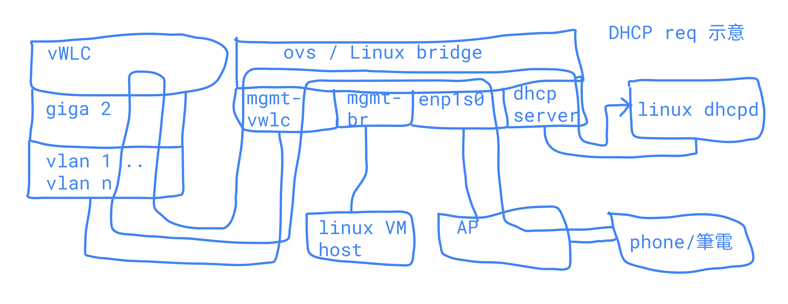

.. Copyright (c) 2023 by Gyoza Associate, Inc.
.. All rights reserved.

=========================
Cisco Wireless Controller 
=========================

.. contents:: Table of Contents
   :depth: 3

簡介
====

Cisco 的 Wireless Controller (WLC) 基本上就是台 VLAN management switch 加上
無線網路管理的 Linux。 共有四種 RTU license 的 WLC 給我們玩，也就是不要錢的。
但裡面還有分別

|

- ME (mobility express 藏在 ac 的 AP 機器, x8xx)
- EWC (Embedded Wireless Controller 藏在 ax, 91xx, 的 AP)
- standalone 獨立 WLC 3504, 5520 ....(單獨一台鐵殼裝機器)
- vWLC (qemu, vmware 用的，但有分 AIREOS 跟 9800CL 兩種)

獨立的 9800 WLC 據說是要為每個 AP 都買 DNA License 不然就 AP 無法 join
controller。 (還要研究研究查證中)，9800CL 則好像說可以玩，自己玩的結果
是可以，但沒有過 60 天不知道會怎樣？ 將來不知道 Cisco 是否都變成這種搶錢模式。
DNA 是一個網路管理軟體，所有想得到的網管參數都可以管，Cisco 內部有其他的
網管軟體，只是目前 AP 大型 deployment 推 DNA。

|

其中

- 四種很像，但界面有點不同, 主要是裡面跑的軟體，一種是以前 AIREOS ，一種是
  IOS-XE ，ax 系列主要以 IOS-XE 為主。版本號碼是 17.x 為主，AIREOS 版本號碼
  是 8.x 為主，IOS-XE 的系統會回到傳統 Cisco IOS 命令，有 enable, config t
  , interface br 等，而 AIREOS 是很奇怪的自己的 CLI 格式。
- ME, AIREOS vWLC, 獨立 3504, 5520 ... 用的是 AIREOS，而 EWC, 9800CL vWLC 用
  的是 IOS-XE。獨立9800 機器也是跑 IOS-XE的。然後四種的 GUI 也有點不一樣。
- ME, EWC 只有一個 eth port 出來，但獨立 WLC 還有 virtual WLC ，都至少要有
  兩個 port 以上，Cisco 網路觀念中，都會有個 data plane (就是一般網路 traffic)
  , control plane (管理機器所需用的網路，管理機器不是想的那麼簡單，當有上千
  台，裡面有很多 logging, snmp, ssh 等)， 因此，通常 management interface 
  跟 data interface 是分開 vlan 的。因此 ME, EWC 的單一 port 通常會是 trunk
  port。然後還會有 dhcp bridge (或叫 dhcp relay) 的設定。
- ME EWC 至少可玩 50 個 AP，vWLC 可玩 200 個，獨立WLC 則看他們不同支援。

networking 的 management interface 跟主機 server 的 out of band management
interface 不一樣。 基本除了管理 management interface 外，

- 獨立與 virtual WLC 要有一個特別out of band 的 service port，這個 port
  是最後手段來進入 controller 的， 這有點像是電腦上的IPMI，LOM management port
  。而 WLC 的 managemnt interface 是管理 AP 所需 traffic， 所以進入 controller
  系統，應該走 managment interface。就像一般機器 ssh eth port，所以習慣主機管
  理的人這裡會搞混，因為名字剛好顛倒了。因此都最少要 2 eth port 以上。 如果其他
  port 因為什麼原因死掉， service port 會永遠都是開的。
- Virtual gateway interface，像 VLAN 上的 gateway, cisco 的 SVI，也因此他最
  重要的是 dhcp relay，所有 client 發出 dhcp 請求，dhcp server 在別的 VLAN 上
  時，要求 agent 代理，controller 用這 IP 來代理。另外像在機場登入，會先進到
  機場 guest web，這個web 與認證也是由 virtual interface 發出將來才能使用機場
  網路。總之他沒有真實 eth port 但要有 IP，來跟手機等 client 溝通，這必須是
  non-routable IP 而且最好遵循 RFC5737 建議，使用 192.0.2.0/24, 198.51.100.0/24
  與 203.0.113.0/24 裡面的網址。 我目前都設定 192.0.2.1。
- 通不通很大部份在 port 與 interface 的定義與限制，例如獨立 WLC / vWLC 必須外接
  trunk port 等等，這樣等於外面一定要有 vlan management switch，接出的 port
  要設成 access port。
- 如果用外部 dhcp server，要把 ipv6 關掉，不然 Linux 的 NetworkManager 會拿不
  到 ipv4.  如果用 iwctl 或 wpa_supplicant 上去就沒這問題。
- dhcp 很重要，一定要設 default gateway, 而且這 default gw 是真的有 mac 
  address 能 ARP 反解回來。
- 另外如果家裡有設奇怪的 firewall， 要打開 capwap udp port 5246 and 5247
- public ntp， https://www.ntppool.org/en/ 裡面有很多個。0.us.pool.ntp.org
- Software download TFTP 也要設好，舊版本的 AP 無法 join 新版本的 WLC。

software.cisco.com 下載與版本
=============================

可以去 software.cisco.com 註冊與下載軟體。

檔案範例
--------

- AIR-AP1815-K9-ME-8-10-185-0.zip ME 能夠指定一個 TFTP server 讓 AP 去那邊
  下載新版軟體升級。zip 檔裡面就是所有目前 ME 支援的 AP。
- AIR-AP1815-K9-ME-8-10-185-0.tar AP 轉換 lightweight 到 ME。
- ap3g2-k9w7-tar.153-3.JPQ.tar AP 升級轉換檔。
- C9800-AP-universalk9.17.09.04.zip 91xx Wifi 6 機型通用 zip 檔。
  這是 IOS-XE 17.x 形式的。轉換 ewc 或升級 17.x 用的。
- AIR-CT3504-K9-8-10-185-0.aes aes 檔是獨立 WLC 機器用的升級檔。

機器型號結尾是 w 的都是小隻的，不行轉成 controller/AP 共有系統，如果做這個
轉換是會把機器弄壞，還一直跳不進 uboot ，所以要去看網路文件確定有支援。

版本對應
--------

版本如果沒有對到，WLC 是無法管理 AP 的， WLC 與 AP 版本要匹配才會 join，
如果WLC 大於 AP，則要設定 TFTP 位置讓 AP 下載，如果 AP 大於 WLC。
網路老外有說最好不要上去，怕有版權問題等等，不過我覺得是他們已經習慣 8.x
版本，不習慣複雜難設定的 17.x 。8.5.x 是最常青版本 但8.5.x 的無法支援
Wifi 6 的 AP。

目前 2023 年 December 是這樣的

- AIREOS 8.x 最新為 8.10.190 ，建議下載停在 8.10.185
- IOS-XE 17.x 最新為 17.13.1 但很奇怪的是建議下載停在 17.9.4
- AIREOS 最常青版本為 8.5.x， 但 8.5.182 不支援 91xx Wifi 6 的 AP
- AIREOS 另外常青版本為 8.10.171。 
- AIREOS 8.10.112 以上才有 9130E 的支援

+-----------+------------+--------------+------------------------+
| IOS-XE    |   AIREOS   |   AP         | 備註                   |
+-----------+------------+--------------+------------------------+
| 17.13.1   |            | 15.3(3)JPR   |    最低支援8.5.182     |
|           |            |              |    最高支援8.10.190    |                                              
+-----------+------------+--------------+------------------------+
| 17.9.4    |            | 15.3(3)JPN3  |    最低 8.5.182        |
|           |            |              |    最高 8.10.183       |
+-----------+------------+--------------+------------------------+
|           |  8.10.190  | 15.3(3)JK10  |    最低17.12.1         |
|           |  8.10.185  | 15.3(3)JK9   |    最高17.13.1         |
+-----------+------------+--------------+------------------------+
|           |  8.10.183  | 15.3(3)JK8b  |    最低17.9.2          |
|           |            |              |    最高17.13.1         |
+-----------+------------+--------------+------------------------+
|           |  8.10.171  | 15.3(3)JK7   |    最低16.11.1c        |
|           |            |              |    最高17.13.1         |
+-----------+------------+--------------+------------------------+
|           |  8.10.112  | 15.3(3)JK1   |    最低17.1.1          |
|           |            |              |    最高17.3.1          |
+-----------+------------+--------------+------------------------+
|           |  8.5.182   | 15.3(3)JF15  |    最低17.8            |
|           |            |              |    最高17.13.1         |
+-----------+------------+--------------+------------------------+

請看 Reference 裡面 support matrix of compatibility 的 Cisco link

Reset
=====

- 跟其他 Cisco 機子一樣，先按住 mode button，再 power on， 20 ~ 30 秒會回到
  factory reset，但保 留一些 configuration 檔。
- 超過 30 ~ 60 會完全清除所有的 configuration 檔。要小心的是有些是已經被人用
  過，所以 AP mode 可能已經變調。光按20秒是變不回來，要 show run，看一下。
- 超過 60 秒，系統認為按鍵壞掉，所有 reset 失效。
- AP 有可能已經被人轉成 WLC mode ，這時按 reset button 只是回到 WLC 初始，而
  不是 lightweight AP 初始。WLC 初始都會進到交談式問答初始程式。
- AireOS WLC 第一次 login ，username 打 Recover-Config 會重來。
  第一次 login ，如果打 Restore-Password 則不會失去 config ，只會創造新 user
- IOS-XE WLC 沒有 login，需要打 wireless ewc-ap factory-reset
- 內定 AP reset mode 可以透過 AP# capwap ap factory-reset mode CAPWAP 改變
  回 lightweight AP 模式。

Mobility Express (ME)
=====================

一般 AP 出廠時大多是 lightweight AP, 但可以去 https://software.cisco.com 下載
轉變成 controller AP 的 software. 目前 x8xx 的 WIFI 5 大部分可以，但要看清楚型
號，有的是不行的。

轉換 ME
-------

reset 後開機， 內定 uid/passwd/enbale 是 Cisco/Cisco/Cisco。
開機後，進去 AP 系統，可以設定 AP 的 IP 等網路基本設定，一開始內定是 dhcp
，但我們要自己設定一個 static ip，用他來下載 tftp 的 image 。

|

AP 系統的 prompt 長這樣

::

  AP00FE.C82D.E250#

AP 這時的 IP 內定是從 dhcp 來，如果沒有，可設 static

::

  AP# show version
  AP# show capwap ap ip config
  AP# capwap ap ip 192.168.1.100 255.255.255.0 192.168.1.1
  AP# show capwap ip config
  AP# show capwap client config
  AP# show run

去 tftp 轉換成 controller AP，如果是AireOS 8.x AP

::

  AP# ap-type mobility-express tftp://192.168.1.101/AIR-AP1815-K9-ME-8-10-185-0.tar

如果是 IOS-XE 17.x AP 則有可能命令

::

  AP# archive download-sw /overwrite /reload tftp://192.168.1.1/AIR-AP1815-K9-ME-8-10-185-0.tar
  AP# ap-type ewc-ap tftp://192.168.1.101/ap1g5 tftp://192.168.1.101/AIR-AP1815-K9-ME-8-10-185-0.tar

重開機後就會直接進入 controller 系統，console 不再是 AP 的系統，prompt 會改變

::

  Cisco Controller)> show sysinfo

從 ME 跳到 AP

::

  Cisco Controller)> apciscoshell

這時候 AP 有兩個系統在跑，一個是 controller ，一個是 AP，其實就是 Linux 用
cgroup container 跑兩個系統。兩個的 IP 不能重複。 一開始的設定精靈 (initial
setup)會幫你設定最基本的 controller 系統。如果兩個 IP 被設成一樣了，趕快回到
AP ， 然後

::

  AP# capwap ip erase static-ip

初始設定
--------

- terminate autoinstall (yes)
- 設定 controller uid/passwd, 我通常設定一個 admin/xxxxxx
- 設定將來所有 AP 的 uid/passwd/enable ，這時 Cisco/Cisco/Cisco 不能再用，
  其中 enable 的 password 會檢查，任何帶有大小寫 Cisco 的密碼都不行。
- 設定第一個 SSID/passphrase
- 設定這台 ME 的 management interface IP, netmask, default route
- DHCP scope (內部有 dhcp server)，這個也可以用外部的，但確保 AP 能拿到。
- 進去後，要把下載來的 zip 檔，解開放到 tftp server，然後 controller 要設定
  讓後續 AP 能 software upgrade，不然版本不合，不能 join。

ping 外面看看，可以通的話，就可以從外面連結了。 management interface 需要
assign 一個 port，但因為 AP 只有一個 eth，所以就是 1 ，可以指定 vlan ，也可以
不指定用 untagged。

- https://10.10.10.10
- ssh admin@10.10.10.10

從 controller AP 轉回 lightweight AP
------------------------------------

必須先轉回 AP

::

  ME# apciscoshell
  AP# ap-type capwap

upgrade AP

::

  AP# ap-type mobility-express tftp://192.168.1.101/ap3g2-k9w7-tar.153-3.JPQ.tar
  AP# archive download-sw /overwrite /reload tftp://192.168.1.1/ap1g7

基本 debug
----------

::

  ME# debug capwap errors enable
  ME# debug disable-all
  ME# show sysinfo
  AP# show version
  AP# show inventory

Embedded Wireless Controller (EWC)
==================================

- 現在網路上 EWC 的新換版本都是 c9800 系列 17.x 版本。
- 9105, 9115, 9117, 9120, 9130 支援，但 結尾是 w，9136, 916x 都不行。
- 同樣去下載，但他的沒有像 ME 分成 tar 檔，其實東西都在 zip 檔內。然後要放到
  一個 TFTP server 下，跟 ME 一樣。在 Administration -> Software Management.
- AP 內定 uid/passwd/enable 一樣是 Cisco/Cisco/Cisco
- EWC 有些 wifi 5 AP 型號也不支援 join，例如有 w 結尾的 wall 小隻 AP 1810w。

轉換成 EWC 
----------

一樣 AP 開機後，AP show version ，如果在 8.x.x 

::

  AP# ap-type mobility-express tftp://192.168.1.25/ap1g7 tftp://192.168.1.25/C9800-AP-iosxe-wlc.bin

如果 17.x.x ，因為已經變 IOS-XE，用這個升級

::

  EWC# ap-type ewc-ap tftp://192.168.1.25/ap1g7 tftp://192.168.1.25/C9800-AP-iosxe-wlc.bin

ap1g7 這個是根據 zip 檔裡面 readme 來的，根據 AP 型號而有不同。而如果
upgrade 出問題，會回到 AP 下，有的17.x 版本是沒有 ewc-ap 命令, 這時候要求用
archive download-sw 命令來 download，這個命令也會出現在 8.x 的版本中。

::

  AP# archive download-sw /overwrite /reload tftp://]/directory]/image-name

初始設定
--------

開機進去會先問要不要 initial setup，這邊就是傳統 IOS 的初始。以前 ME 是別組
寫的，17.x 版本全部用 IOS-XE 編譯，所以很多 IOS 習慣會回來。以 17.9.4 版本做
測試

轉換完，有兩種情況，第一是繼續 console， 不管怎樣 EWC 已經起來，
console 會繼續， 但問

::

  Would you like to enter initial configuration dialog (yes/no) yes

  Configure default wireless AP profile country code in ISO format [US]:
  Enter the hostname [EWC]:
  Configure credentials for management access on Access Points? [yes]:
  [AP] Enter the management username: admin
  .....

他會先問要不要 configure AP username/password，再問 EWC 的，我一樣
都設定 admin/xxxxxx，將來所有 AP 的 username/password 都會是這個設定。

第二種是用手機或者 laptop 去看，應該會有一台叫 CiscoAirProvision-xxxx
的 AP，內定 passphrase 是 'password'，用他連線，會進到 web 設定，
https://mywifi.cisco.com ， 初始 uid/passwd 是 webui/cisco。

- 使用第二種方法也好。因為其實新的 AP 裡面都有 TAM chip （跟 TPM 一樣意思)
  ，然後內定會啟動一個叫 PnP 的 daemon 會使用 TAM 上的 certificate，
  去連 Cisco 的網站做設定，要斷掉 PnP ，console 要趕快按鍵或者從 wireless
  連進才會讓本機做設定。 所以習慣第二種也好。
- 設定完 static ip 要 write memory

如果按 mode button reset 機器，則他也不會再回到 AP console，已經在 EWC，EWC
console PnP 卻是會一直去找 dhcp 要 IP。這時沒有像 ME 有 Recover-Config 可以進
去。只能用 GUI 方式，無線台找 CiscoAirProvision-xxxx。因此一旦在這個狀態，要
打斷 PnP， 只能用這個方法。要打斷 PnP 後才能進到 CLI。

沒有 DHCP

::

  EWC> en
  EWC# show interface GigabitEthernet 0
  EWC# config t
  EWC(config)# interface GigabitEthernet 0
  EWC(config-if)# ip address 192.168.1.11 255.255.255.0
  EWC(config-if)# exit
  EWC(config)# ip default-gateway 192.168.1.1
  EWC(config)# end

  https://192.168.1.11

可以用 debian/ubuntu 設定一個 dhcp server，
如果使用 isc-dhcp-server ，設定 INTERFACEv4 在 /etc/default/isc-dhcp-server

自設 DHCP pool， 這好像舊版的 aireOS WLC 都不行，但家裡有其他分享器等有 dhcp
server 的就不用設了， 可以去 GUI 中 Administration -> DHCP Pools 中設，也可以
CLI

::

  EWC#show run | include dhcp
  EWC#show ip dhcp pool mgmt
  EWC(config)# ip dhcp pool service
  EWC(dhcp-config)# network 192.168.2.0 255.255.255.0
  EWC(dhcp-config)# default-router 192.168.32.1
  EWC(dhcp-config)# dns-server 8.8.8.8
  EWC(dhcp-config)# exit
  設成只要11 ~ 50
  EWC(config)#ip dhcp excluded-address 192.168.2.0 192.168.2.10
  EWC(config)#ip dhcp excluded-address 192.168.2.51 192.168.2.255

AP join
-------

AP 插上網路，內定都會 dhcp 要到 IP ，就 broadcast capwap，然後就全自動，
如果 AP 的版本不對盤，就會自動去跟 controller 下載更新，AP console 會看到如下

::

  AP image version 17.9.4.27 backup 8.10.185.0, Controller 17.9.4.27

  EWC# show wireless ewc-ap ap summary

轉換回 lightweight
------------------

之前的 ME 命令變化，進到 AP 以前用 apciscoshell ，現在改用

::

  EWC# wireless ewc-ap ap shell username admin
  AP> en
  AP# ap-type capwap

admin 會是在 initial setup 設定的一個 AP username 與 password，
但是轉回 lightweight 後，有的版本又可以用 Cisco/Cisco/Cisco 了

ME 用 Recover-Config reset， 但 EWC 必須用 mode button 或 login EWC 後，用

::

  EWC# wireless ewc-ap factory-reset

新觀念與命令
------------

- profile 是某個整組的設定，然後可以給某類型 AP 整個設下去。目前內附的 profile
  default-profile，有 WLAN Profile, Policy Profile, Flex Profile, AP Join
  Profile 跟 RF profile.
- 然後 EWC 又在上面使用叫 tag 的大包包，一個 tag 可以包含不同
  profile 設定，目前有 rf-tag, policy-tag, and site-tag。

Standalone WLC 與 AireOS vWLC 共同點
====================================

除了原本就有的 management 跟 virtual gateway interface 外，standalone
跟 virtual WLC 都還有一個 service port ，這個 service port interface
原意是暫時提供第一次設定的服務，但很混淆 management interface。但他的作用
相當於 server 系統中的 light-out-management, IPMI。

|

有些特別跟 ME/EWC 不同的是

- 除了 service port 外，其他的 port 連上 switch port 都須是 trunk port，
  如果沒有，則除了 service port 外，所有的 port 不會起來。show port summary
  會顯示都是 down state。他這其實是裡面 Linux 跑了一個 VLAN switch。
- 系統其實有兩個 partition, part1, part2 然後在他們裡面稱為 primary backup
  image 交互 booting，一個是 active 時，就是 primary。在 Advanced -> COMMAND
  下的 "Download File" 選擇 "code"，這裡面下載從 software.cisco.com 下載的
  aes 檔。在 config boot 裡面選擇下次要 boot 的 image。
- 不需要額外設 TFTP software 位置給 join 的 AP。 因為 AP 機器不像獨立機器有很
  大的 ram disk。 在 ME/EWC 我們都要指出一個 tftp server 讓將來連上的 AP 能夠
  升級， 但獨立 WLC 與 vWLC 的 AP image 都是伴隨著 controller image 直接在
  controller 裡面了。每次 upgrade aes 檔就自然帶有 AP 的 image 了。
- predownload AP 新版本是說機器在線時，不要去打斷服務，可以先把 AP image 倒給
  AP， 當升級 controller 檔 xxxxx.aes 檔後， primary 跟 backup 都發生變化，我們
  可以要求 AP 一樣先 downlaod primary 或者 backup，然後選個時間 interchange，
  設定在 Wireless->Access Points -> Global Configuration。這個其實就是之前 AP
  的 archive download-sw ，只不過沒有馬上 /reload 而已。
- 要去 activate RTU license ，不然 controller 不會動，AP 不會 join。

基本上用 VM，就是設定兩台 switch，一台是 controller，一台是 openvswitch 或者
linux bridge。兩台 vlan switch 對接，本來就要 trunk port 對接。

::

  (Cisco Controller)> show port summary
  (Cisco Controller)> show interface summary
  (Cisco Controller)> show license summary

以下為兩台 virtual switch 對接，phone 的 dhcp request 示意圖，這在後面除錯
時很重要。

AIREOS Virtual Wireless Controller (vwlc)
=========================================

一樣去下載，有 vmdk, qcow2, iso 等版本，我選擇 small iso 版本就夠了，我喜歡
從頭開始安裝全新的，然後家裡用 small 的支援就可以了，檔案比較小，可能版權也
比較簡單。 他這界面比較跟獨立的 3504 一樣，跟 ME 又有點不一樣。

- 可帶 200 台 AP
- 本身不帶 dhcp server，需要一個外在 dhcp server
- support Cisco FlexConnect (跨網路管理遠方 AP)，而且 AP join 後，要改成
  flexconnect mode 才會廣播 SSID。vWLC 不支援 local mode AP。
- 至少需要兩張虛擬網卡, 代表上面所說的 service port 與 management port
  。注意！當 VM 起來後，一定要能從 mgmt interface 連，從 service port
  連進是沒有意義的，他會 block 掉所有 management traffic。
- 文件說應用 virtio-net-pci，但我用 e1000 也可以
- vwlc port 只支援使用 trunk mode, 因此可以簡單用 openvswitch 來達到。
  也就是說在 vwlc 內部 Linux 中，一定也是跑一個 vlan switch，然後他內部
  Linux 看到的 2 個 port 是串到 vlan switch 的，因此我們在 host 上也必
  需用個 vlan switch 接住，要就設定 openvswitch，不然就要用 linux bridge
  設定成 vlan switch。請看上面示意圖。
- 最後這vWLC 如果要支援 9117 ，要多下載一個 AP bundle, 由於我是下載 small
  ，所以是 AP_BUNDLE_CTVM_SMALL_8_10_190_0.aes。這個要在 GUI 中，
  COMMAND -> Download File -> File Type 選擇 code -> 設定 tftp 與 aes 檔名，
  讓他下載自動 applied。

使用 openvswitch 與 libvirt
---------------------------

openvswitch 本身內定就是個 management switch (vlan 802.1q switch)，我們用一
般業界大型使用的 libvirt 與 openvswitch 來管理 VM。

|

裝 openvswitch 與 libvirt

::

  debian: openvswitch, libvirt-daemon, libvirt-daemon-system, virtinst
  redhat: openvswitch, libvirt, libpython-virtinst
  arch  : openvswitch, libvirt

網路設定最重要，根據 Cisco 網站 deployment guide，但我改一下名字讓他更貼近
service 與 managment port 概念。

::

  service switch, default 使用所有 0-4095的 vlan
  service.xml
  <network>
    <name>service</name>
    <forward mode='bridge'/>
    <bridge name='service'/>
    <virtualport type='openvswitch'/>
    <portgroup name='vlan-any' default='yes'>
    </portgroup>
  </network>

  mgmt switch ，也一樣
  mgmt.xml
  <network>
    <name>mgmt</name>
    <forward mode='bridge'/>
    <bridge name='mgmt'/>
    <virtualport type='openvswitch'/>
    <portgroup name='vlan-any' default='yes'>
    </portgroup>
  </network>

使用 virsh 來啟動網路。

::

  ovs-vsctl add-br mgmt
  ovs-vsctl add-br service
  virsh net-define service.xml
  virsh net-define mgmt.xml
  virsh net-list --all
  virsh net-start service
  virsh net-start mgmt

把外部真實 ethernet port 加到 vlan switch, 並且設定 switch IP

::

  ovs-vsctl show
  ovs-vsctl add-port mgmt enp1s0
  ovs-vsctl set port enp1s0 vlan_mode=access
  ovs-vsctl set bridge mgmt other-config:forward-bpdu=true
  ip addr add 192.168.1.1/24 dev mgmt
  ip link set dev mgmt up

由於 enp1s0 插進 mgmt 這個 VLAN switch ，所以他自動變成 trunk port，我們
必須設定 enp1s0 為 access port，不然會出不去。IP 黏在 mgmt 這個 ovs
internal type port. Cisco Discovery Protocol 需要forward-bpdu=true。mgmt
是可以黏上 IP 的 openvswitch internal interface, 這種是 openvswitch 幫
我們特別建造的 interface，就像在 Linux bridge 下，IP 是要黏上 br0，不是
enp1s0，因為 enp1s0 已經變成一個 switch port ，不再是 host 上的 port。

::

  man ovs-vswitchd.conf.db

  會發現 ovs 的 database 的幾個內定 table 名稱：
  Open_vSwitch, Port, Interface

  ovs-vsctl list Bridge
  ovs-vsctl list Port
  ovs-vsctl list Interface

|

要全新建造一個 VM ，必須用 virt-install 或 GUI virt-manager，我們用 CLI 就好
，這邊要注意的是 virsh 內定會使用 -cpu host 把 host 的 cpu 設給 guest VM，
但 Cisco vWLC 無法吃某些 CPU 設定，也無法吃 pcie。要用低階點的虛擬硬體。
virsh domcapabilities 可以看到有哪些 CPU 是被支援的。選比較保險的 core2duo
跟 linux2016，請不要擅自換成別的，會失敗。

::

  virt-install --connect=qemu:///system 
  --name=vwlc
  --cpu core2duo
  --osinfo linux2016
  --network=network:service,model=virtio
  --network=network:mgmt,model=virtio
  --cdrom=/home/user/MFG_CTVM_SMALL_8.10.185.0.iso
  --disk path=/var/lib/libvirt/images/vwlc.img,size=8
  --ram 2048 --vcpus=1 --vnc --vncport=5901

  virsh console vwlc

如果 kernel panic, 那還是 CPU PCIE 問題，libvirt 設定很複雜， 也可先用 qemu 
把他裝起來， shutdown 後，再用 virsh edit vwlc 然後把這行 host-passthrough 幹
掉，還有確定裡面不是用 pcie bus。

::

  <cpu mode='host-passthrough' check='none' migratable='on'/>

再 virsh start 起來後，如果沒有趕快按鍵，則 output 會自動到 serial console
去，然會跟 ME 一樣設定，

::

  (Cisco Controller) > show port summary (要確定是 Link Status up)
  (Cisco Controller) > show interface summary
  如果沒有 IP 又沒有 DHCP
  (Cisco Controller) > config interface address management 192.168.1.10 255.255.255.0 192.168.1.1

試看看外面

::

  (Cisco Controller) > ping 192.168.1.1 (剛剛設在 mgmt 上的)

這時可以 https://192.168.1.10 連回來 controller， 要設定 license RTU 並且最
多可 join 200 個 AP， 沒接受 EULA ，contrller 是不會動的。在 GUI 中，選右上
Advanced -> MANAGEMENT -> Software Activation 或者 CLI

::

  (Cisco Controller) license activate evaluation ap-count eval
  (Cisco Controller) license add ap-count 100
  (Cisco Controller) show license summary
  (Cisco Controller) show auth-list

(這我弄了好久，因為我一定要用 vWLC 管理 AX 機器, 然後我先用 9120axi 8.x 的
轉成 ewc 來測試 EWC，結果他變成 17.9.4，然後我開始用 vWLC，卻是 8.10.x 的，
然後一直 join 不起來，我一直懷疑是不是版本不對，去把所有版本釐清，還是不行
，一直懷疑 vWLC 無法管 WIFI 6 AP ，結果卻只是沒去 activate license)

|

由於 vWLC 沒有內建 DHCP，要自己外面有一個才能 AP 接上就能 join。 

|

這時要廣播 SSID 必須把 AP 設在 flexconnect mode，可以去 GUI 改，
在 WIRELESS -> All APs -> AP mode 下改從 local -> flexconnect。CLI 好像無法改，
必須從 controller 去改，但可以看到 status

::

  AP# show flexconnect status

最後內定是 PSK Enterprise，我們要把他改成 PSK Personal， GUI 在 WLAN ->
Security -> Layer2 裡面，然後要設定 WPA PSK 密碼。

每次 CLI 更改前要關掉 wlan，更改完後要 save config

::

  (Cisco Controller) config wlan disable all
  (Cisco Controller) config interface address management 192.168.1.100 255.255.255.0 192.168.1.1
  (Cisco Controller) config wlan enable all
  (Cisco Controller) save config

最後成功用 8.10.183 與 17.9.4 版本完成測試。然後關機時要用 soft reset

::

  (Cisco Controller) restart

再趕快 virsh destroy 掉，不然多玩幾次，filesystem 會壞掉。

使用 Linux Bridge 與 qemu-system-x86_64
---------------------------------------

用最簡單的 qemu 命令與 Linux kernel 本身帶的 bridge。 只是他內定是傳統 802.3
bridge swtich，ovs 是內定為 802.1q vlan management switch，一種就是外面賣的
便宜 unmanagement switch, 一種就是比較貴的 management switch。但 Linux bridge
也可以設定變成能 forward 802.1q frame 的 VLAN management switch，當 port 被加
進來不帶任何參數，內定有 vlan 1 的 access port。

|

不管是哪種 switch，原本對於 Linux 網路 interface 的觀念要修正。

- 原本 OS 上的 interface eth0, eth1 ... 是能貼上 layer 3 IP 的 host interface。
- 當我們設定有一台虛擬 802.3 bridge switch，他是一個 broadcast domain 的王，
  所以也通常是整個 LAN 下的 gateway，也能貼上 IP。
- 但一旦我們插上我們的 eth0, eth1 ... 或者假 tap0, tap1 ...， 這會變成 switch
  上的 port，不能有 IP 黏在上面，你能設定你家 switch port 的 IP 嗎？
- vlan switch 則是多 port 802.3 switch，所以當他的 port 是 trunk port 時，表示
  裡面有很多台 802.3 bridge，對應每個 VLAN， 每個 VLAN 可以貼上一個 IP 代表整
  個後面的 packet 轉發。
- 因此 eth0, eth1, tap0, tap1... 是 host interface，或是 switch port 兩者是要
  分清楚的，而 br0 如果是 802.3 switch，則只能有一個 IP 黏在上面，如果是 VLAN
  switch，則可以多個 IP 黏上，這時我們會產生新的 Linux subinterface，br0.1 與
  br0.100 代表不同 mac address 與不同 vlan。

最簡單完全用 Linux kernel bridge 設兩個 vlan switch, mgmt-br 跟 service-br，
還有兩個假 tap 網卡, mgmt 跟 service， 把他跟實體網路 enp1s0 接上 bridge。
enp1s0 如果原本有 IP 要把他拿掉哦

::

  # ip link add dev mgmt-br type bridge vlan_filtering 1
  # ip link add dev service-br type bridge
  # ip tuntap add mode tap service
  # ip tuntap add mode tap mgmt
  # ip link set dev service master mgmt-br up
  # ip link set dev mgmt master mgmt-br up
  # ip link set dev enp1s0 master mgmt-br up
  # ip link set dev mgmt-br up
  # ip addr add 192.168.1.100/24 dev mgmt-br
  # bridge vlan add dev mgmt vid 100

  看一下結果，看有 802.1Q 與 vlan_filtering 1
  # ip -d link show master mgmt-br
  # ip -d link show mgmt-br
  # bridge -d vlan

重要的是網路設定，第一網路 interface 為 service port，第二網路為 mgmt，
不准亂私設 mac address 給 guest，前面 OUI 必須是 52:54:00 或者有意義 OUI，
不然 port status 為 down。

::

  # qemu-system-x86_64 
    -name vwlc -m 4g -smp 4 -enable-kvm
    -netdev tap,ifname=service,id=service,script=no
    -device virtio-net-pci,netdev=service,mac=52:54:00:cc:bb:aa
    -netdev tap,ifname=mgmt,id=mgmt,script=no
    -device virtio-net-pci,netdev=mgmt,mac=52:54:00:aa:bb:cc
    -drive file=vwlc.qcow2,format=qcow2
    -cdrom=/home/user/MFG_CTVM_SMALL_8.10.185.0.iso

一樣一開始initial setup 要設定

- controller uid/passwd admin/xxxxx, 
- AP uid/passwd/enable (將來 login 所有AP都用這個)
- service interface 是用來一開始
- 一樣設定 management interface IP/netmask/default route
- VLAN可以選 untagged 表示 VLAN 0。

::

  show port summary
  show interface summary
  show interface detailed management
  show interface detailed service-port

show port summary 一定要看到 Link Status 是 up 的，不然就根本不會通。

9800CL vWLC
===========

- 9800 型號 controller 原本是獨立機器的 controller ，但他也有 virtual 給 qemu
  用的，特別型號是 9800CL，software.cisco.com 下載在 9800 分類裡面，他這跟 EWC
  一樣， based 在 IOS-XE 上的 code，所以CLI 命令，GUI 跟 EWC 是接近的。但設定
  比 EWC 複雜，一堆安全設定非常麻煩。
- 需求比較高，要2cpu 4Gram 16G disk 以上，可以建造 3 個 vnic 以上， 但最少也
  跟 AIREOS vWLC 一樣，要兩個 vnic ，第三個可以做 HA interface，更多可作 VLAN。
- 9800CL 據說是可以免費用的，但要研究研究。基本網路限制也差不多，mgmt 外必須是
  trunk port。

原本在 AIREOS 中混淆的 service port 跟 management interface 終於讓 IOS 的人
受不了了，變成 device management interface 與 wireless management interface
，也就是

+---------------+----------------------+------------------------+
| 傳統 server   |   IPMI port          |  ethernet0             |
+---------------+----------------------+------------------------+
| AIREOS        |   service port       |  management interface  |
+---------------+----------------------+------------------------+
| IOS-XE        |   device management  |  wireless management   |
+---------------+----------------------+------------------------+

你說這些人，尤其文人政客媒體等是不是吃飽沒事幹?? 其實是 IOS 跟 AIREOS 是兩個
不同組開發的，AIREOS 是外面買進來的公司，IOS 是原本 Cisco 就有的，所以購併進
來的兩組，用詞，整合等等的也是一大問題。 所以真正將來要用 web GUI
的是從 wireless management interface 進來，在選擇時，可以看到預設值都是這樣
狀態， default route 0.0.0.0 也是在第二 ethernet port 設定。
但 AIREOS 不把 service port 顯現，所以 management interface 是在 port 1，
而 9800CL 則是 device mgmt 在 giga 1，wireless mgmt 在 giga 2。

使用 openvswitch 與 libvirt
---------------------------

同樣用 openvswitch, virsh 啟動 9800CL ，網路沿用 AIREOS vWLC 的設定，要接受
所有 VLAN，切記切記。 一樣跟上面一樣，從 ovs-vsctl add-br, virsh net-define,
net-start 啟動網路 只是這次我們 virt-install 可以選比較先進的 CPU 不會 crash。

::

  virt-install --connect=qemu:///system 
  --name=9800cl
  --cpu SandyBridge
  --osinfo linux2020
  --network=network:service,model=virtio
  --network=network:mgmt,model=virtio
  --cdrom=/home/user/C9800-CL-universalk9.17.09.04a.iso
  --disk path=/var/lib/libvirt/images/9800cl.img,size=16
  --ram 4096 --vcpus=4 --vnc --vncport=5998
  --console pty,target_type=virtio
  --noreboot

  virsh console 9800cl

安裝可選 VGA 或者 serial console 的，我們選 serial console 。可以用
virt-viewer 去看 VGA 也可以。 起來後選 package.conf 開機，因為 Golden
image 意思是這個 image 是不可寫入的，將來出問題可以從這個 golden image
+ 備份的 configuration 救回來。

|

前面的問答比較不一樣，但只要記得 device management 是 AIREOS controller 的
service port 就好，

這裡有個非常重要的分水嶺，選擇不是 wireless management VLAN 1 跟選是 1 的
VLAN ID 會讓後面完全設定不同， 選擇 VLAN ID 時，切記要選不是 1 的 VLAN ID。

以下是選擇 VLAN 1 的情況，後來會很慘，花了很多時間。

::

  Setup device management interface (aka Service Port)? [yes]: 
  Select interface to be used for device management
   1. GigabitEthernet1 [Up]
   2. GigabitEthernet2 [Up]
  Choose the interface to config [1]: 
  Configure static IP address? [yes]: 
    Enter the interface IP [GigabitEthernet1]: 10.10.10.10
    Enter the subnet mask [GigabitEthernet1] [255.0.0.0]: 255.255.255.0

  Configure static route? [yes]: 
    Enter the destination prefix: 10.10.10.0
    Enter the destination mask: 255.255.255.0
    Enter the forwarding router IP: 10.10.10.1

  Enter the management username: admin
  Enter the password: *********
    Reenter the password: *********

    ....

 Choose the deployment mode
    1. Standalone
    2. Active(Cannot configure)
    3. Standby(Cannot configure)
  Enter your selection [1]:
  Configuring wireless management interface
    Select interface to be used for wireless management
     1. GigabitEthernet2 [Up]
    Choose the interface to config [1]:
    Enter the vlan ID (1-4094): 1
    Configure IPv4 address? [yes]:
      Enter the interface IP [GigabitEthernet2]: 192.168.1.10
      Enter the subnet mask [GigabitEthernet2] [255.0.0.0]: 255.255.255.0
    Configure IPv6 address? [yes]: no

  Configure static route? [yes]:
    Enter the destination prefix [0.0.0.0]:
    Enter the destination mask [0.0.0.0]:
    Enter the forwarding router IP: 192.168.1.1
  Enter the hostname [WLC]:

  Configure credentials for management access on Access Points? [yes]:
    [AP] Enter the management username: admin
    [AP] Enter the management password: *********
      [AP] Reenter the password: *********
  [AP] Enter the privileged mode access password: *********
    [AP] Reenter the password: *********

  Configure country code(s) for wireless operation in ISO format [US]:

  Configure default wireless AP profile country code in ISO format [US]:

  ....

剩下的就除了 AAA (RADIUS), ipv6 不要 configure, PSK 選 personal 外，都用內
定值就好。

剛裝完，如果 https 進不去，那要打開 http authentication

::

  WLC# config t
  WLC(config)# ip http authentication local
  WLC# write memory

|

另外現在所有通訊都透過 TLS, DTLS，所以要有 certificate，Cisco 機器都有像 TPM
的 TAM chip，就是 private key, certificate 都藏在裡面，現在 9800CL 不是真機器
，所以要建造自己的 self-signed certificate (SSC) 做為將來跟 AP 溝通的 device
certificate，這個會讓系統裡預藏的 root CA 簽名，在 AireOS 沒有做這動作是
AireOS vWLC 安裝時，自己做掉了。 這個在
GUI 是在 Configuration -> Security -> PKI Management -> AP SSC Trustpoint
-> Generate，已經做了就不要再做。

::

  WLC# wireless config vwlc-ssc key-size 2048 signature-algo sha256 password 0 Cisco@123

  WLC#show wireless management trustpoint
  Trustpoint Name  : WLC_WLC_TP
  Certificate Info : Available
  Certificate Type : SSC
  Certificate Hash : b4be87245bf21ba36062f35669073405b6833962
  Private key Info : Available
  FIPS suitability : Not Applicable

現在是回頭寫這段， 初始設定把 wireless mangement VLAN 設成 1 ，結果他會把
GigabitEthernet 2 設成 access port, no switchport，並且把 IP 設給 giga 2
，同時這個 wireless SSC 也不會自動做，要手動做，我本來很高興，用最簡單的
access port 也會動啊，不用那麼麻煩，但光這個 SSC 就花了我很久時間找到答案，
最慘的是 AP 能 join 了，卻發生 client 拿不到 DHCP IP 這件事，這又花了我很
長時間找答案。總之用人家成功的例子是比較沒有 hassle，只是想不到光 VLAN
設不一樣，後面程式跑的路徑完全不同，要設其他 VLAN, 則在 host 上的 tap
interface 也要接受這個 vlan id，ovs 當初我們設 xml 時，已經接受所有 vlan，
不然初始設定 script 是失敗的，總之這個 SSC 沒有跑出來，後來在 console 上果
然注意到製造 vWLC-SSC 時有錯誤訊息，我猜是初始 script 在設定 trunk port
上出問題，中間就壞掉，以至於後續的動作都沒完成。 切記切記。

::

  Configuring wireless management interface
    Select interface to be used for wireless management
     1. GigabitEthernet2 [Up]
    Choose the interface to config [1]:
    Enter the vlan ID (1-4094): 100
    Configure IPv4 address? [yes]:
      Enter the interface IP [Vlan100]: 192.168.1.10
      Enter the subnet mask [Vlan100] [255.0.0.0]: 255.255.255.0
    Configure IPv6 address? [yes]: no

總之如果初始用 VLAN 1，則要多跑 vwlc-ssc 那個命令，還要把 giga 2 轉為 trunk

::

  9800(config)# interface Giga 2
  9800(config-if)# switchport
  9800(config-if)# switchport mode trunk
  9800(config-if)# switchport trunk allowed vlan all
  9800(config)# int vlan 1
  9800(config-if)# ip addr 192.168.1.10 255.255.255.0
  9800(config-if)# no shut
  9800(config-if)# ip helper-address 192.168.1.200

  9800CL# show ip int br
  9800CL# show interface giga 2
  9800CL# show run | inc management

要看到 giga 2 在 trunk port 狀態，VLAN 要是 up 狀態， management interface
需要是 VLAN。

同樣關機不能像真的 arm 機器一樣，因為他是用一般 hard disk 的，所以要 write
mem，或者用 

::

  9800CL# reload

命令，然後 reboot 時，趕快 power off VM。

9800CL license 一直是我擔心的，因為文件上說獨立 9800 機器是一定要為 AP 買
DNA management license 才能 join 的。但 9800CL 是不同於 9800 機器的。

根據 Cisco 網站說明，9800CL 沒有 RTU，但還是有 Evaluation license，
一樣這也只是 information 性質而已，60 天後在 syslog 會出現但不會有影響。

::

  9800CL# show udi
  9800CL# show version | section license

由於還沒玩過 60 天，所以不知道 9800CL 60 天後會怎樣？

9800CL 開啟 ssh server
----------------------

9800CL 裝完是沒有 ssh server 的，要去設定 line vty 0 才有。

::

  9800CL(config)# ip ssh version 2
  9800CL(config)# ip ssh window
  9800CL(config)# ip ssh timeout 90
  9800CL(config)# line vty 0 10
  9800CL(config-line)# login local
  9800CL(config-line)# transport input ssh

這用 GUI 設定反而有點麻煩，要先去 Configuration -> Security -> AAA ，
下面 AAA Methold List 新加一個 default, Type 是 login, Group Type 是 local
，然後再回到 Adminstration -> VTY 設定，指定 VTY interface 使用 local 的
authentication list，總之 9800CL 的安全設定是 IOS 那套， 抽象化的很複雜，
一堆非常複雜不同的組合限制，一個設錯，就完全不能動，非常惹人厭。

AP client 使用 DHCP server
--------------------------

不像 ME, EWC, aireos vWLC 那樣接上就能用， 9800CL 的 DHCP server 很麻煩。
可用外部 dhcp server ，也內部可以設 dhcp server，請看之前 dhcp request
示意圖。

* controller 只是一台 dhcp relay agent，同時是 AP client 的 dhcp server
* 不管是 internal, external dhcp server， 所有 client 都透過 controller 代理請
  求 IP。只是如果是外部 dhcp server，則 controller 安裝時，有設一個外部 dhcp
  server IP (ip helper) 了。Internal dhcp server 則必須把自己設成 ip helper。
* dhcp 正常講只是 layer 2 的往返，不該設 IP 地址的，dhcp client 發出 layer 2
  broadcast dhcp request，dhcp server 接到，還回 dhcp response，如果不在同
  broadcast domain，則 bridge/switch 有設 dhcp relay 時，會轉發到另一個網路
  。只是 bridge/switch 上有 IP/mac 的 ARP mapping 資料庫，所以有設 dhcp ip
  helper 時，在 mac 的 destination 是可以直接送過去的，不需要 broadcast，也
  不需要 relay agent。
* controller 本身當 dhcp relay (ip helper)，而這個  dhcp relay 還可以往上送
  另一個 dhcp relay 直到真正的 dhcp server。因此 ip helper, dhcp server 與
  dhcp relay 才會變成好像同義詞。在 Linux 上也可以分開裝 dhcp server 與
  dhcp relay。
* 正常講 Layer 3 IP 不需要設，就能完成 dhcp ，所以設 VLAN SVI，default route
  跟 dhcp 成功不見得有關係。 9800 的 dhcp relay 都在 access port (giga 2) 跟
  vlan interface SVI 上設定。
* 如果是一般 ethernet 機器，則發出 dhcp request 時，layer 2 上的 dhcp relay
  會收到，這時會封裝好另個網段 dhcp packet，往外 dhcp server 發出 dhcp request
  。 dhcp relay 上會有 ARP IP/mac 資料庫 mapping 資料。
* 但現在這個代理是由 AP 向 controller 發出 capwap packet，再由 controller 向
  ip helper 請求，所以 AP <-> controller 這段是看不到 dhcp request packet ，
  只有最後回來告訴 IP 的 dhcp response，才會看到。

以上都是理論，結果測試結果是

* 是可同時給線上 AP 跟他的 client
* 9800 是 switch，內定已經設自己是 dhcp relay，因此往外的 dhcp request frame
  是強制用 802.1q frame，所以任何從 management port 送出的 dhcp frame 都要
  trunk port 來發送。
* 因此 gigabitethernet 2 要設成 trunk port，不然 client 拿不到 DHCP IP。

如果當初已經設了 VLAN 1， 簡單一點就是所有 AP, AP client, controller 都在單
一 VLAN 1 上，沒有一堆 VLAN 的最簡單內定 VLAN 1 設定。則
 
* giga 2 設成 allow 所有 VLAN 的 trunk port，這時看  vlan 1 才會真正 up。
* wireless management interface 要設成 VLAN 1
* VLAN 1 SVI 要設一個 IP 取代原本 giga 2 IP。

::

  9800(config)# interface Giga 2
  9800(config-if)# switchport
  9800(config-if)# switchport mode trunk
  9800(config-if)# switchport trunk allowed vlan all
  9800(config)# int vlan 1
  9800(config-if)# ip addr 192.168.1.10 255.255.255.0
  9800(config-if)# no shut
  9800(config-if)# ip helper-address 192.168.1.200
  9800(config) wireless management interface vlan 1

如要複雜的 VLAN 管理設定則需要設定新的 tag，新的 wlan porfile 與 新的 policy
profile。因為 Client 通過 AP WLAN 連上後面網路，而 WLAN 設定在 WLAN profile，
第一個建立的就是我們設定的 SSID，而 tag 用途是把 profile 黏在一起的， 把 WLAN
設定與一個 policy profile 連上關係是在 default-policy-tag 下設定，只是要新設一
個 tag 將來給 WLAN 用。

::

  tag => wlan profile <-> policy profile
  policy profile => wlan id associated with vlan id

內定連上 VLAN 的 policy profile 是 default-policy-profile 下的 VLAN，當初在
init setup 設定的。在 default policy 中也有設定 DHCP server required，但那是對
client 講的，表示 client 不能用 static IP 連上來，一定要透過 AP 要求的 dhcp
IP 才會放行，這公司有 security 考量會這樣做。

如果使用內部 dhcp server，新設一個 VLAN 讓他 ip helper 指向自己，自己變成 dhcp
relay (dhcp server)， 與設定 VLAN 跟 WLAN 的綁定

::

  9800(config)# ip dhcp pool mgmt
  9800(dhcp-config)# network 192.168.100.0 255.255.255.0
  9800(dhcp-config)# default-router 192.168.100.1
  9800(dhcp-config)# dns-server 8.8.8.8
  9800(dhcp-config)# end

  dhcp relay (ip helper) configuration，設定 controller 本身是 relay agent
  9800(config)# interface Loopback0
  9800(config-if)# ip address 10.10.10.1 255.255.255.255
  9800(config-if)# exit

  9800(config)# interface vlan 100
  9800(config-if)# ip address 192.168.100.254 255.255.255.0
  9800(config-if)# ip helper-address 10.10.10.1
  9800(config-if)# no mop enabled
  9800(config-if)# no mop sysid

  9800(config)# wireless profile policy default-policy-profile
  9800(config-wireless-policy)# central dhcp
  9800(config-wireless-policy)# central switching
  9800(config-wireless-policy)# description "default policy profile"
  9800(config-wireless-policy)# vlan 100
  9800(config-wireless-policy)# no shutdown

  9800# show ip dhcp binding
  9800# show wireless dhcp relay statistics

那為什麼之前 ME, EWC, vWLC 都沒這麼麻煩？不知道，或許同為 IOS-XE based 的 EWC
當初設定不是 switch controller，所以內定的設定就是一般設定。ME, vWLC 是老式
aireos 可能也不像 IOS 這麼討厭。

總之這個 17.9.4 GUI 設定在 Configuration 下的 Ethernet, Vlan, Static Routing,
WLAN, Tags, Policy, Internal DHCP server 在 Administration -> DHCP pool。
設個 DHCP server 非常繁瑣。

把 WIFI 6 6GHz 打開
-------------------

wifi 6 有 6 GHz 的 band 可以用，但根據 WIFI alliance 規定，6G Hz 必須使用
WPA3 ，不准有 WPA2，所以必須把 WPA2 拿掉，17.9.4 必須是只有 WPA3 設定好，
但使用界面有點無所適從，不知道這規定的人同時設 wpa2/wpa3 時，6G 一定起不來，
17.13.1 卻可以直接用 6G Hz。

使用 Linux Bridge 與 qemu-system-x86_64
---------------------------------------

同樣跟上面 AireOS vWLC 一樣建立 VLAN switch 跟相對應的 port，
但是 managment 要設 VLAN，所以請多加VLAN ，假設用 100 在 GigabitEthenet 2
turnk port， 還有 qemu-img， qemu-system-x86_64 啟動 VM

::

  ip link add dev mgmt-br type bridge vlan_filtering 1
  ...

  bridge vlan add dev mgmt vid 100
  ...
  qemu-system-x86_64 -name 9800cl ...

這邊後來就照著前面 openvswitch + virsh 一樣設定就可以了。但不同的是 linux
bridge 的 prot 必須多加 vlan。請往下看。

|

如果想要玩 IOS-XE CLI，不管是 EWC, 9800, initial setup 說 no，會進到
IOS CLI，這時就要有設定 IOS CLI 能力， 不過也可以先說 yes， 走完設定再回來改。

::

  Would you like to enter initial configuration dialog (yes/no) no

請看 https://www.youtube.com/watch?v=MeDwvj0LxhU
從 8:45 開始看，前面都是廢話，根據這個 youtube 用 CLI 設定 VLAN 也有趣。
主要是 interface GigabitEthernet 2 他設定 trunk port，並且黏上 VLAN 才算
可以，因為用 openvswitch/virsh 的設定中，並不需要。在 內定設定
中的 9800CL， show ip int br 跟 show run interface giga 2 的 VLAN 1 是
down, giga interface 也是 no switchport，access port 照樣也可以。

::

  9800CL# show ip interface br
  9800CL# show run interface GigabitEthernet 2
  9800CL# show wireless interface summary
  9800CL# config t
  9800CL(config)# hostname myhost
  9800CL(config)# no username admin (username 是舊命令, 如果之前設的話，拿掉)
  9800CL(config)# user-name admin
  9800CL(config)# priviledge 15
  9800CL(config)# password Cisco@123

主要是這段，我設了 vlan 100 做為外面溝通，外面 mgmt-br 是 192.168.1.1
，這時 mgmt 這個 tap 與 enp1s0 必須設 vlan, 總之就是 mgmt enp1s0
mgmt-br 3 個 port 現在是 switch port ，enp1s0 外面連著 AP，mgmt 連著
9800CL, mgmt-br 連著 host 機，3 個 port 中，mgmt 必須進出都不能丟掉
100 的 tag，而 enp1s0 跟 mgmt-br 出來必須丟掉 100 的 tag。

pvid 表示進去 switch 要加 tag，untagged 表示出來 switch 要丟掉，
self 表示這是一個 bridge port。而所謂進去，就是這三個 port 互傳時，他們
其實走的是802.1q 的 frame。

::

  # bridge vlan add dev mgmt vid 100 pvid untagged
  # bridge vlan add dev enp1s0 vid 100 pvid untagged
  # bridge vlan add dev mgmt-br vid 100 pvid untagged self
  # bridge -d vlan

::
  
  9800CL(config)# interface Giga 2
  9800CL(config-if)# switchport
  9800CL(config-if)# switchport mode trunk
  9800CL(config-if)# switchport trunk native vlan 100
  9800CL(config-if)# no shut
  9800CL(config)# interface vlan 100
  9800CL(config-if)# ip address 192.168.1.10 255.255.255.0
  9800CL(config)# wireless management interface vlan 100

  9800CL(config)# ip route 0.0.0.0 0.0.0.0 192.168.1.1
  9800CL(config)# ip name-server 8.8.8.8
  9800CL# write memory

這個 wireless management interface 如果內定的話，是 GigabitEthernet 2,
這在 GUI 在 Configuration -> Interface -> Wireless, Configuration -> Interface
-> Ethernetnet 與 Configuration -> Layer 2 -> VLAN。

這邊再回到跟 openvswitch + virsh 一樣設 self signed ceritifcate(SSC)，與打開
web http login, ip http authentication local 功能。

更多 CLI 練習請看 Reference 的高級 debug youtube.

Virtual WLC 使用結論
====================

- 目前 AireOS 跟 9800CL 都可以用， 兩者都能 join 91xx WIFI 6 的 AP。
- 版權的話，9800CL 還不是很清楚， 9800CL 感覺是未來趨勢， GUI 也比較漂亮。
- 但 9800CL 安全設定非常繁雜，很多內定設定都沒有設，裝完不懂的話，根本無法用，
  我想這是很多老外都不建議上 9800 版本的原因，因為本來網路用的好好的，一上
  新東西，完全都毀掉，還不知道怎麼辦， 連 ssh 都要額外設定才會開，
  將來的 certificate 更新更是複雜，總之 IOS-XE 9800 漂亮是漂亮，但設定實在抽
  象太繁瑣，一點不同就完全行為不同。
- openvswitch+virsh 或 qemu+bridge 都可以，就是 AireOS 要自己帶 dhcpserver
- ovs+virsh 方案要多安裝 package 但適合真的大部署，qemu+bridge 就簡單多了。
- 嘗試 upgrade/downgrade 所下載 8.10.171 ~ 8.10.190 ~ 17.9.4 感覺都可以
- 其實用 x86 來跑的速度比 arm 系統快很多

::

  root@hp-8300:~# virsh list --all
   Id   Name         State
  -----------------------------
   -    9800cl       shut off
   -    dhcpserver   shut off
   -    vwlc         shut off

獨立WLC 3504
============

只以 3504 這個最基本的來說明。(因為沒有 9800 機器:-)

- 設定跟前面AireOS vWLC 幾乎一樣
- 本身雖有 dhcp ，但文件不推薦使用，希望能用外在 DHCP server, 要設定。
- 3504, 5504 .... 跟 AIREOS 的 vWLC 是一樣的，GUI 也比較一樣。

前面設定跟以前一樣，除了他這個有多 port ethernet ，所以要決定

::

  Service Interface IP Address Configuration [static][DHCP]: 

  Enable Link Aggregation (LAG) [yes][NO]: 
  mGig Port Max Speed [1000][2500][5000]:5000
  Warning: Setting Max Speed of Port 1-4 to 100 Mbps
  Warning: Setting Max Speed of Port 5 to 5 Gbps

這邊要慎選mGig 的最大速度，如果選 1G 才有五個都是 1G。不然會變成其他
port 有的不滿 1G。

比一般 AP 強的管理
==================

很多企業級的管理，一般人根本就不會去玩，連最簡單的 SNMP ，我看一般人也不會去
玩，但卻是 Cisco 一定會支援的 protocol。一顆幾萬台幣的 AP，軟體管理還是最重要
的。

mobility auto-anchar
--------------------

無縫接續 AP 漫遊，需要設定 mobility group，代表一個漫遊 group，裡面所有成員
會對應到 controller, AP，SSID，只有在 group 裡面的成員才會自動傳遞 client
訊息達到漫遊。

Cisco 的漫遊 (roaming) 可以用在像機場，棒球場等幾千台的漫遊，跨 WLAN/VLAN
的 roaming。待續...

flexconnect
-----------

跨 WAN, VPN 遠端 AP 管理, 待續...

AAA
---

RADIUS/TACACS+ 設定, 待續...

失敗了怎麼辦
============

以下為碰到的失敗狀況

console 亂七八糟的字元
----------------------

這是 serial speed 不對，要選 115200 ，主要是 engineer 版本裡面的 uboot
都被工程師亂改， 會這樣，upgrade 正式版本後，通常就換回 9600。

::

  screen /dev/ttyUSB0 9600 cs8 -ixon -ixoff
  screen /dev/ttyUSB0 115200

不然就是開機後，按 ESC 進到 uboot，去 printenv setenv 改回來

另外AP 模式是有個 config boot 命令可以改 baudrate，其實就是去改 uboot 變數

無窮 reboot
-----------

這件事情我終於玩出來了，在 google Cisco AP infinite loop 的時候，發現有兩篇類
似情況，bug (CSCvx32806) 是無窮的 boot 跟我的情況很接近， 但 Cisco claim
說是 AP 在跨 WAN upgrade 時，不知道為什麼 image corrupted 了，我查了內部
bug ，還是找不到原因跟不知道怎麼辦。workaround 是進 uboot 然後毀掉那個壞掉的
partition，boot 回原本的 image。

但還有一個 CSCwa12652 說是 9120/9115 製造日期在 Oct 2020 到 Oct 27 2021 間的
firmware 出問題，也會一直 boot，但這個解方只有下載一個神秘 link 下的 image，
這些 image 是所謂 boardinit image，是製造 AP 時整個殺進去的。link 給的是
8.10.130 的，並且是用 9120 做例子。

https://www.cisco.com/c/en/us/support/docs/wireless/catalyst-9120axi-access-point/217537-repairing-c9120-c9115-access-points-from.html

我的情況卻發生在 9105axi 與 9105axw 上，發生兩次，一次是我用 9105axw 轉 EWC
結果失敗，我本來想可能 EWC 宣佈的支援沒有 9105axw 所以他失敗了，所以只好還給
回收桶。但後來我又拿到一些 9105axi ，這次卻是在 9800CL 上 join 時，upgrade
到17.9.4 版本時掛掉。同樣的 symptom ，可不能白白浪費可愛 9105慘死，就順便玩玩
uboot，玩了一天，發現我的 9105 的 nand device 只有一個，不像其他的型號有兩個，
不知是否我的是 engineer sample，所以他是沒有備份的。因此 CSCvx32806 的
workaround 只會更慘，因為要大家把壞掉 partition 毀了。

我最後試了8.10.130 的 Manufacture Image，還是沒有成功，但因為有 bug id，所以
我找到了 bug description，以及 build 所在，在 17.9.4 中本來還用 8.10.130 的
類似檔名 image ，還是失敗，但忽然發現一個 
bundle-ap1g8-wp-wifi6-single-17_9_4_27.img ，ap1g8 是給 9105 等 AP 用的，然後
他既然有單獨出，就試看看，結果成功了!!!! 這個要進 uboot ，並且用 tftp server
才行。

::

  uboot> setenv ipaddr 192.168.1.100
  uboot> setenv serverip 192.168.1.101 
  uboot> setenv tftpdir /
  uboot> boardinit bundle-ap1g8-wp-wifi6-single-17_9_4_27.img

我是覺得

- AP, uboot 好像有個內定 IP，Cisco 好像設在 192.168.1.1，剛好是我設定的
  gateway，不知道這是否造成 IP 衝突。
- 用 PoE switch，還有 virtual switch 不知道在 forward packet 時不穩定，
  造成 UDP 的 tftp 不穩。
- 總之，不要用 AP, uboot 的 IP，也盡量用真實網路設備或許就沒問題。boardinit
  是最後救命神丸，但 image 只有內部員工有。

vWLC 開機起不來
---------------

- AireOS kernel 不能用高級 CPU 跟 PCIE 設備，而 virt-install 自動用高級裝備。
- AireOS 裝起來後重開機，在 VGA 模式如果沒有按鍵，則 console 自動到 serial。

vWLC 網路不通
-------------

基本上 openvswitch+virsh 比較簡單，不通失敗多是 qemu+bridge 自己亂設， 關鍵是

- port 必須是 trunk port，linux bridge 要加 vlan_filtering 1。
- mac address 須是有意義的 OUI, 52:54:00 是 qemu 的，所以 vmware 的也能成功。
- interface 沒有 up，kernel bridge 要手動 ip link set xxx up。

裝或換了WLC，但 AP 無法 join
----------------------------

- dhcp 沒有設好，default gateway 要能反解 ARP。
- ME 或 EWC 要設定 TFTP server Adminitration -> Software Management，讓 AP 能
  變成跟 controller 同版本。
- 第一次 AP join 只能使用 MIC certificate，controller 亂設成不准使用 MIC。
- 第一次 AP join，AP certificate 過期了，請看 certificate 過期解釋。
- AireOS vWLC 的 license 沒有去設定接受 EULA 與 ap-count 設定。
- 由於我們拿到的 AP 都是美國版，無線電波 regulation domain 是 B，所以 WLC 安裝
  時，請選擇 US 地區與設定 TW 地區。好像可以同時設兩種。
- 同樣的AP ，可以 join EWC, AIREOS vWLC，卻沒辦法 join 9800CL ，一開始在 DTLS
  階段就失敗，而且是 DTLS cert-chain not available ，這是因為 Cisco 機器都有類
  似 TPM 的 TAM 晶片，但 9800CL 是軟體沒有，所以要建立一個 trustpoint 倉庫，有
  一個 self signed root CA certificate (SSC) trustpoint。ME, EWC 與 AireOS
  vwlc 都會自動建一個 trustpoint 給自己用，9800CL 不會。
- 9800CL，錯誤訊息 unexpected DTLS version 1.0，查 Troubleshooting -> Logs，
  發現 AP 用的是 1.0，AP 是 8.3.x 這時可以設定 controller 的 dtls 版本的。
  WLC(config)#ap dtls-ver dtls_1_0，他這也蠻蠢的，要下載新 image 才會有 1.2
  ，但卻因為 dtls 不對，無法下載，變成雞生蛋蛋生雞問題。

::

  vWLC# config ap dtls-version dtls_1.0
  9800CL(config) ap dtls-version TLS_1_0

- Controller 從 9800CL 17.x 到 AireOS 8.x，則之前 join 新版本 17.x controller
  的 AP 無法再 join 舊版本 8.x controller，這時檢查 log,  show logging，
  controller 出現 Error: sslv3 alert certificate unknown while communicating
  with peer， AP 出現 vWLC Certificate verification error。

這是第一次 join 跟第二次 join 問題， 先說結果，解方

* 重新按 AP reset button 後可以解決，重新來一遍。
* 這是我笨笨的用同一 script 跑的兩個相同 mac address 的 vWLC，所以 AP 他認
  hostname 跟 mac address 時，發現同樣的東西怎麼變了，所以認為這 controller
  有問題拒絕 join，正常在外面情況應該不會發生這種事。所以我把 hostname 跟
  mac address 換新的後，就好了。

但 debug 有助於我們了解， 看 AP 上次 controller 設定了什麼東西

::

  AP# show capwap client config
  AP# show run

本來已經 join 一個 controller，後來再 join 其他 controller 有問題，因為
certificate 設定已經變調。通常原本的 controller 會設定 AP 要 validate ssc
hash， 所以要先把 AP 裡面的 ssc hash validation 關掉才行

::

  (previous vWLC)> config certificate ssc hash validation disable
  previous 9800CL# （不知道怎麼做)

但這又蠻笨的，先有雞先有蛋問題，應該說拔線之前要先做前面命令把所有 AP 設成
不 validate ssc hash。9800 找不到相對應命令，大概認為這蠻雞肋的吧。

網路上說另用 auth-token ，然後一樣要用舊的新的 controller 在那邊移來移去是沒
什麼意義

::

  AP# capwap ap auth-token Cisco@123
  previous vWLC# config certificate ssc auth-token Cisco@123
  prevous 9800CL(config)# wireless management certificate ssc auth-token 0 Cisco@123

  new vWLC# config certificate ssc auth-token Cisco@123
  new 9800CL(config)# wireless management certificate ssc auth-token 0 Cisco@123

或者直接設 hash，必須先抓到 AP 的 SHA 1 hash，沒有 AP 的 certificate，須打開
controller debug

.. # openssl x509 -fingerprint -in ap.crt -noout 或者
   # openssl x509 -in ap.crt -outform DER | sha1sum

::

  vWLC# debug pm pki enable (會跑出很多 log ，裡面有
  sshpmGetIssuerHandles: SSC Key Hash is 
    9e4ddd8dfcdd8458ba7b273fc37284b31a384eb9

然後要設 controller 能用 AP 的 sha1 hash

::

  接受 AP 的 ssc certificate 跟他的 hash 設定
  vWLC# config auth-list ap-policy ssc enable
  vWLC# config auth-list add ssc 00:0e:84:32:04:f0 9e4ddd8dfcdd8458ba7b273fc37284b31a384eb9

  這個是設定使用 MIC certificate 的 AP 來看 auth-list
  vWLC# config auth-list ap-policy authorize-ap enable 
  
  9800CL(config)# wireless management certificate ssc trust-hash
    9e4ddd8dfcdd8458ba7b273fc37284b31a384eb9

這個測試是完全失敗的，真不知道網路上寫的怎麼成功，總之都是要在之前能 join
controller 先設好 AP 參數，新 controller 才會接受。 AP 沒有 join 完全無法對他做
事情。

|

除非是大公司，AP 裡面已經有很多特殊設定，最後辦法不如就清除整個
configuration，等於 reset

::

  AP# capwap ap erase all

當然 reset mode button 也有效，除非是大公司，機場等地方，如果是家裡用，就
reset 所有 AP 就好了。總之 join 如果是第一次，那就是 certificate 可能
過期，版本可能不對，dtls 可能不對，如果是第二次，那就是即使版本對也可能不能
join ，遠端又沒有 ssh,  只能靠 terminal console 連過去，如果有上千台，
只能靠 script 做事。

vWLC 看到 AP，卻沒有 SSID 廣播
------------------------------

AireOS vWLC 只支援 flexconnect mode 的 AP。 GUI 在 WIRELESS -> All APs ->
AP mode 下改從 local -> flexconnect。CLI 好像無法改，但 AP 可以看到

::

  AP# show flexconnect status

還有 vWLC 沒有給我們設定 PSK Personal，內定變 PSK Enterprise，一般家用設定
沒有需要的話，要自己去 GUI WLAN 改成 Personal。

Linux 筆電拿不到 IP
-------------------

這要檢查 DHCP server，DHCP server 如果有發 IPv6 ，那 NetworkManger 蠻討厭的，
會拿不到 IP。用單純的 iwctl 或者 wap_suppliant 命令做 client，就拿得到 IP。
請關掉 DHCP server 的 IPv6, 如果用 isc-dhcp-server 的話，那就是在
/etc/sysctl.conf 關掉整個 ipv6 就好。

::

  sysctl -w
  net.ipv6.conf.all.disable_ipv6=1
  net.ipv6.conf.default.disable_ipv6=1

在 9800CL，AP client 拿不到 IP 
------------------------------

最剛開始，初始設定，設 wireless management interface 的 VLAN 1，造成所有 port
都是 access port, native vlan 1 的情況， 雖然 AP 可以 join 也拿到 IP，但 AP 的
客戶手機卻什麼都拿不到，用 tcpdump 去看也都什麼都沒有。但用 Troubleshooting
-> RadioActive Trace 可看到 client 已經通過 PSK 檢查。
正常如果什麼都不設，那應該所有東西都在 VLAN 1 上，AP 檢查完 PSK，應該正常就要
到 IP 才是。

使用 Troubleshooting -> Packet Capture，設定 dhcp filter，會產生一個 dhcp.pcap

::

  tcpdump -qns 0 -X -r ~/Downloads/dhcp.pcap

結果看到的是 AP 用 capwap 5247 port 向 controller 發出 client DHCP 要求，而不
是真的 dhcp port 67,68 ，所以是由 controller 再通過向 ip helper 發出 dhcp 要求
，去看 enp1s0 的 port 5253 與 5247，也的確一直有 packet， 但我的 dhcpserver
port 卻一直沒有 dhcp request 進來。我在 GigabitEthernet 2 跟 VLAN 1 的 dhcp
relay 都已經有設了我的 dhcp server 了。所以是 controller 沒有向 ip helper 發
出 dhcp 要求？

看了所有人的方法都是設定 VLAN 的， 我注意到我的 VLAN 1 的 operational status
一直都是 down 的狀態，所以如果 dhcp request 在建造時，用的是 802.1q 的 VLAN 1
frame，那就永遠送不出去。

我之前都一直用 access port 玩，從來沒有真正上過 client DHCP，認為能 join 了，
AP 都拿到 IP 了，而且 ME, vWLC，EWC 都成功了，就沒繼續玩，想不到，真的
wireless management interface 不能用 access port，必須用 trunk port，不管是
external 還是 internal DHCP server，gigabitethernet 2 都不行用 access port 。
也就是在都是 access port 時，從 client 一路到 controller 這段，用 802.3 走
還沒問題，但從 controller 發出的 dhcp request ，如果是 WLC 做的 802.1q
layer 2 frame， 這沒有 trunk port 則兩邊 virtual switch 是不通的。

最後是照別人設定，然後我用最簡單粗暴方式

* gigabitethernet 2 用 trunk mode, 允許 all vlan, native vlan 用本來設定 1
* 由於 giga 2 已經變 trunk port 所以沒有 IP 了，wireless management interface
  要設成 vlan 1，vlan 1 SVI 要設 原本 giga 2 的 192.168.1.10，才能繼續用。
* 網路說要設定 dhcp relay，但由於我用最簡單的單一 vlan，所以不用設 dhcp relay
  也能成功。

上面是用 external 方式成功的，總之這個在初始設定時，如果 wireless managemnt
interface VLAN 是 1 ，則會自動設成 access port，在 join 時，感覺 layer 2 的
frame 會根據下面 port 狀態而自動變成 802.3 traffic，但 dhcp request 給 dhcp
server 時，卻一定用 802.1q frame。 因為我設 WLC 的 IP 從來就都是用 static ，
從來沒有用過 DHCP，而 ME, EWC，內部跑的 AP 與這情形不同，vWLC 我猜因為一定要
用 external dhcp server ，所以他建造 dhcp request 時，也應沒有強制用 802.1q。

總之如果在其他 WLC 碰到這種狀況，首先檢查 traffic, trunk port/access port
設定。一旦 port 設成 trunk port ，則 VLAN operational status 就會 up。

uboot 命令
----------

就是開機後，注意螢幕，趕快按 ESC 就會跳進 uboot，基本命令

::

  printenv

  storage:
  partition, mtdids, mtdparts 三個變數跟 storage 有關，help mtdparts
  nand info
  mtdparts
  ubi part fs
  ubi info

  network:
  setenv ipaddr 192.168.2.2
  setenv serverip 192.168.2.1
  setenv gatewayip 10.1.1.1
  setenv image_name part.bin
  setenv tftpdir /tftpboot
  ping 192.168.2.1
  saveenv (不要亂存，測試的話就直接 boot, netboot就好)

  device tree:
  fdtcontroladdr 變數藏著 fdt 的位址。
  fdt addr
  fdt list
  md 0x1fe80fc

  fdtcontroladddr mtids mtdparts 這些變數都是 uboot 建造時，裡面所帶 script
  在 flash image 時寫進去的，所以不同 image 會不一樣值。

  boot command:
  boot  (這會從 env 變數 bootcmd 走)
  netboot (這會去找內定的 tftp server 跟 tftpdir, image_name)
  nandboot (這就是從 nand 記憶體 boot)
  tftpboot (一樣是 netboot)
  boardinit bundle-axel-SS-8_10_130_0.img
  tftp ${loadaddr} xxxxx.bin

  debug
  setenv baudrate 9600
  setenv MANUAL_BOOT 1 (每次開機會停住)
  setenv ENABLE_BREAK 1 (能讓 ESC 發生作用)
  setenv BOOT part1 (從 第一 partition boot, 有兩個才是，每 upgrade 只是寫到另一個 partition)

新版的 uboot，有的舊版命令像 nandboot 等已經不見，prompt (BTLDR) 改用 bootipq, bootm，
一些特別變數，或者有的變數可能就沒設

::

  baudrate=115200
  boot_cnt=1
  bootcmd=bootipq
  bootdelay=2
  bootparm=init=/bin/sh
  bootparms=init=/bin/sh
  delenv=sf probe && sf erase 0x000e0000 +0x10000
  ethact=eth0
  fdt_high=0x87000000
  flash_type=0
  fw_upgrade=0
  install_cal_to_end_of_nor=sf probe && sf read 0x84000000 0x170000 0x10000 && sf erase 0x1f0000 +0x10000 && sf write 0x84000000 0x1f00
  ipaddr=192.168.1.11
  machid=8010100
  nand_erasesize=20000
  nand_oobsize=40
  nand_writesize=800
  primary=0
  proceed_upgrade=0
  product_id=WAC510
  secondary=3800000
  show_cal_at_end_of_nor=sf probe && sf read 0x84000000 0x1f0000 0x10000 && md.b 0x84001000 0x40
  stderr=serial
  stdin=serial
  stdout=serial

Certificate 問題
================

這篇很重要，因為如果 certificate 壞掉了，不懂，AP 沒有設好，AP 就會變磚頭。

AP, controller, client, management 等之間的通訊現在都走 REST API，都仰賴 TLS,
DTLS，這都需要兩邊一開始交換 key (certificate)，一旦過期，所有通訊都斷掉。
這曾經是非常大的 bug，造成別家大公司非常火大，因此現在有些 code 居然不查
expiration date。

不同的通訊可以用不同的 certificate ，所以在 controller 上有很多個
certificate 同時在運作，包括 AP join 用的，web server 用的，跟其他
Cisco 管理軟體 DNA, SDWAN 溝通的又不同等等。

certificate 認證是 PKI 的方法，他需要有一個 Root Certificate Authority
CA 簽過 CSR 成為一個 certificate，表示這 certificate 是我 CA 認證的沒問題，
外面做 CA 這生意的例如 VeriSign, Symantec, ... 因此除了過期問題外，還需要
有合格 certificate 問題，預藏 root CA 可以不只一家，而同一家也可由一個
root certificate 簽過的所有 certificate 都可以認證，整條簽過的稱為 root CA
certificate chain。每個客戶想要一個 certificate 時，必須向 CA 提出 CSR
(certificate sign request) 讓他們簽。

Cisco 機器出廠有跟 TPM 很像的 TAM，雖然也出外面標準的 TPM 機器，但總之就是
private key, certificate 藏在一個 chip 裡面。Cisco 上面程式透過所謂的 SUDI
(Secure Unique Device Identity)，一種私有的存取位置格式程式庫，來存取
certificate，與請求 challenge string siging，外面完全不知道 private key 長
什麼樣子，而這個晶片裡面的 certificate 就是已經用 Cisco 認可的 root CA 簽過
的 device certificate了，所以當他跟別的機器溝通時，別的機器也有藏這些 root
CA，於是一比對認證就放行了。這種 device certificate，Cisco 也叫他 MIC
manufacture installed certificate.

所以 Cisco 機器裡面一定藏有兩件事，其實也是所有 pki 就這兩件事，瀏覽器
裡面也是一樣這兩個東西，其他都是文字遊戲。

- 一個藏一堆 root CA certificate chain 的倉庫，一般稱此 certificate store。但
  respository ... 等名詞。這也可以指向某一台 server 叫 CA server，真是夠了。
- 一個已經由 store 裡面的某個 root CA certificate 簽過的 device certificate

有著 public/private key 還有其他 x509 所需創造 CSR, certificate 參數的倉庫，
Cisco 稱 trustpoint。 將來溝通時，就是拿著某個 trustpoint 裡面的 certificate
到處玩，然後每次系統上的 trustpoint 裡面的 root CA certificate 來認證，只要有
一個可以，就可以放行。產出的動作叫 enroll ，產出的檔案去處為 entrollment。

CA server 則是除了倉庫外，能跨網路接受要求去做簽證的管理動作，通常這有一個網
路 protocol (如 SECP, EST or ACME) 負責 client 與 CA server 溝通。

除了預藏 root CA certificate 外，通常會給使用者加加減減 store 裡面的
CA certificate 能力，因為各公司有可能用自己的 root CA certificate，不用外面
的，外面要付錢公開，用自己 self-signed cert (SSC)，不用付錢也不用公開，只做
內部私有通訊。Cisco 有的給一個名稱為 Enterprise Certificate。 vWLC 由於沒有
chip，一定都要有 SSC device certificate， 如果沒有 device certificate，就無
法溝通了。

因此在 Cisco certificate 術語中的 device certificate

- mic manufacture installed 出廠在機器裡面的，這通常是 TPM/TAM 裡面的
- ssc self signed 用自己的 root ca certificate signed 出的 certificate
- lsc locally significant 用遠端 CA server 所 sign 出共同用在 controller與ap
- trustpoint IOS-XE 中有public/private key 與能提供 CSR certificate 簽章，
  分發的任何形式的庫房，如果是能發 CSR 的，那 key 必須是 exportable 的。
- 除了 local 外，IOS-XE 裡面自己可當一台 CA server，也可設定外面 CA server，
  把他想成像 Linux package repository 一樣，只不過他管理分發的是 certificate
  而已。 trustpool 就是裡面的所有 certificate，相當於 repository 裡面所有的
  packages。

MIC 基本我們不管了，就是如果是實體機器，那自然就有，我們也動不了這些
，因此我們都專注 SSC。SSC 的 rootca certificate 應該是沒公開的，但 sign mic
的那些 rootca certificate 有可能是 Cisco 對外公開 certificate 下生出的徒子徒孫
certificate 再去 sign 的。所以 self signed web server 的用 broswer 去連，就會
彈出要小心的字眼，但不要緊。

AireOS 看 certificate 的 CA issuer 與有效日期，

::

  AP# show crypto local-ca
  AP# show crypto pki trustpool
  AP# show crypto

其中 local-ca 就是原本的 root CA， 舊版沒有這命令，這應該是為了區別遠端 ca
cert 後來所新給的命令。 trustpool 是所有 AP 這個 Linux 內藏認可
的 root CA store (這應該是 openssl 目錄下)，crypto 就是 device certificate
，這個要注意 issuer 跟有效日期。正常 device certificate 是由 local-ca
某一個 sign 出來的，而這 local-ca 應該是 trustpool 下的某個 certificate,
認證時，是由 trustpool 裡面撈出一個來認證的。

在 controller 上，有很多個 certificate ，內定會有一個 web server 用的，這個
跟 device 彼此溝通的 device certificate 是不同的，安裝時會自己自動安裝，

如果是 virtual WLC，則沒有硬體 device certificate，vWLC
安裝時，自己用預藏的 root CA，做了一個 ssc 為 device certificate，這是跟 AP
溝通實用的。

::

  相當於 AP 命令的 trustpool
  vWLC# show certificate all
  vWLC# show certificate ssc （只看有的 ssc)

但 9800CL 在安裝後卻沒有製造出來，必須我們手動親自製作一個，在 9800CL 有個
簡單的一行命令，或者在 GUI Configuration -> Security -> PKI Management ->
Trustpoints 下面有個 AP SSC Trustpoint，按他會產生一個新的，但如果已經有 AP
join 了不要亂按，新的會造成 AP 舊的 join 失效。

::

  9800CL# wireless config vwlc-ssc key-size 2048 signature-algo sha256 password 0 Cisco@123

這內定是產生一個 WLC_CA 的 CA server 與 trustpoint WLC_WLC_TP ，並且
把他用給我們 management interface 溝通時所需 certificate。 看我們產生的 SSC
certificate 的日期 ，會顯示一個 device certificate 跟 sign 他的 root ca
certificate。

::

  9800CL# show wireless management trustpoint
  9800CL# show crypto pki certificates WLC_WLC_TP

這個 SSC 除了在 9800CL 有用，在一些舊的 AP join 也有用，因為早期 AP 的 hash
是只用 sha1 ，這種 AP 會造成 join 不成。

::

  所有的 CA certificate 倉庫
  9800CL# show crypto pki trustpoints
  所有的 root CA certificate
  9800CL# show crypto pki trustpool
  藏著走 management interface 的 device certificate 與他的 root ca certificate
  9800CL# show wireless management trustpoint
  看所有的 certificate 等於 vWLC 的 show certificate all
  9800CL# show crypto pki certificate

如果是 9800 會有兩個 trustpoint 藏著不同 certificate

- TP-self-signed-xxxxx 這是跟 browser 溝通用的 router SSC certificate。
- WLC_WLC_TP 這才是 device SSC certificate 跟 AP 溝通用的。

基本上 AP 上面無法做太多事情，他的 mic 是本來出廠就給的，ssc 來源有升級軟體
自己帶來的，或者 controller 推過來的，lsc 也一定要透過 controller 來，AP 
裡面沒有命令，但裡面的程式會由 controller 來執行一些 certificate 設定。大多
數 certificate 設定都在 controller 上。

Certificate 過期問題
--------------------

後續維護，我想只有 certificate 過期這件事最讓我擔心，因為我就是在做這個的，
Cisco 裡面程式早期沒有考慮那麼多，很多居然是 10 年就會過期，10 年現在看起來
就是一下就過去的事，現在科技已經不像以前3, 5 年的東西無法再用。

如果是 TAM/TPM 下的 certificate，mic, 機器有點年紀的話，像我的是 2016 年的，
那麼是 2026 年就到期了，我在 AP 下的 "show crypto" 會看到 有三個，SHA1 SHA2
兩個在 2026 年就到期，最後一個是後來 upgrade AP 軟體安裝上去的，這個就比較
久一點，例如裝 17.9.4 版本，因為他在 2022 年 12 月發行，所以變成有一個 2022
到 2037 年的 certificate。如果在 vWLC 上看到 show certificate ssc 也會是只有
10 年。所以很蠢的是 TAM/TPM 晶片的 mic 過了 10 年就不能用了，哈哈。而這新 ssc
也很蠢有效日期是固定死的，也就是如果15年後用15年前 release 的軟體一樣不行。

::

  AP# show crypto

  vWLC# show certificate all (看自己, 所有 CA cert 其實沒什麼用)
  vWLC# show certificate ssc (看自己)
  vWLC# show ap config general AP00F2.8B3E.E548 (vWLC 好像沒有 AP certifcate)

  9800CL# show crypto pki certificate WLC_WLC_TP (看自己)
  9800CL# show ap name AP00F2.8B3E.E548 config general (看AP)

controller 這邊都好解決，問題是如何讓 AP 用上新的 certificate，因為 AP 上根本
沒有命令讓我們維護。每個第一次 join 一定會用到自身的 certificate 一次，將來才
可以用 controller 提供的 ssc 來溝通，因此過期的 certificate 第一次 join 不會
過。

如果是第一次 join， 基本上過期了就雞雞了，因為根本沒有 controller 可以控制
AP，解方只有

- AP 想辦法升級到新版本，像在最早使用 ap-type, archive download 命令或 uboot
- 第一次一定用內藏 MIC certifcate ，所以 controller 那邊要記得不要亂設。

我後來用 8.10.171 的 1815i AP，並沒有三個，直到我用 17.9.4 才有，AP 每次升級
新版，才會產生新的 ssc certificate，而舊版的就只能仰賴 TAM/TPM 裡面的 mic
certificate，所以看來要避免過期，要一直升級，如果 Cisco 20 年後不支援，就
雞雞了。但在已經 join 的 AireOS based 的 controller 中，可以設定 AP 不管
expiration date，如果不想升級到新的 controller, AP 版本

::

  (Cisco Controller)> config ap cert-expiry-ignore mic enable
  (Cisco Controller)> config ap cert-expiry-ignore ssc enable

如果已經發生了，那把時間調回去再設定，因為這些都必須從 controller 設定已經
join 的 AP。

::

  (Cisco Controller)> config time ntp delete 1
  (Cisco Controller)> config time manual 09/30/18 11:30:00

9800CL，要先找到 issuer 名字，在 ap 上面或 controller 上都找得到

::

  9800CL(config)# crypto pki certificate map map1 1
  9800CL(ca-certificate-map)# issuer-name co Cisco Manufacturing CA
  9800CL(config)# crypto pki certificate map map1 2
  9800CL(ca-certificate-map)# issuer-name co ACT2 SUDI CA

  9800CL(config)# crypto pki trustpool policy
  9800CL(ca-trustpool)# match certificate map1 allow expired-certificate

如果 AP 升級了，像 17.x 帶有一個新簽 15 年的固定 ssc， AP join 會自動選擇
嘗試。

GUI 看 AP 用什麼 certificate, AireOS 在 Wireless -> Access Points，
IOS-XE 在 Configuration -> Wireless -> Access Points 點進去在 Inventory。

::

  (Cisco Controller)> show auth-list
  (Cisco Controller)> config auth-list ap-policy ssc enable
  (某個 AP 使用ssc with 他的 hash)
  (Cisco Controller)> config auth-list add ssc 00:0e:84:32:04:f0 9e4ddd8dfcdd8458ba7b273fc37284b31a384eb9

也就是說過期這件事都是 mic 惹的禍，internel Cisco root ca self signed 的
device certificate 為 internal ssc， 只是後來幫忙擦屁股，只是最終我們希望用
自己產生的 external root ca certificate ssc 是控制在使用者手上的。 而不是仰
賴 Cisco 幫我們做的 SSC。

光使用上，WIFI 6 AP 91xx 的還好，現在是 802.11ac WIFI 5 的 AP 比較麻煩，
以目前我所下載的 17.13.11 或 8.10.190 來看最多就是能用到 2038 年 12 月。
不過只要 2038 年前，controller 先設定了不管 expiration date，就還好。

而要 AP 使用我們自己做的 SSC，目前唯一工具就是用 lsc，請 controller provision
一個 certificate 讓 AP 使用，但這也要 AP 已經在 controller 控制底下才行。
如果是第一次 join，MIC 過期等等問題都要把 controller 時間調回去，讓 AP
先 join，如果已經 join 再轉 join 發生問題，也是無法再改動，除了重回第一次
join 外都很麻煩。

Openssl certificate 產生工具
----------------------------

certificate 就像圖檔可以有很多jpg, gif, png ...格式，只不過我們現在通用的是
x509 格式，然後 TLS/DTLS 也是拿這格式，並且定義一些規定的參數，attribute
，根據這些規定參數決定動作。

一般產生 x509 certificate

- 產生一個 public/private key pair
- 根據那個 keypair 與 x509 的參數例如 subject 內的 CN ... 生成 CSR
- 請求 root CA 簽一下。

製作自己的 CSR, CA 與 self signed certificate，這可以用 openssl, gnutls tools
等工具。 而正統用兩道命令步驟產生 CSR，假定我們使用 RSA public/private key，
如果想用比較先進的 EC keys，得用新的 genpkey 命令

::

  openssl genrsa -aes256 -out csr_pkey.key 2048
  openssl genpkey -algorithm RSA -out csr_pkey.key -aes-256-cbc

  openssl req
  -new
  -key csr_pkey.key
  -out csr.req
  -subj "/C=US/ST=CA/L=SJ/O=Gyoza/OU=DE/CN=gyoza-${RANDOM}.gyoza.com"

另外可用一道命令產生一個 CSR 並同時產生相對應的 private key, 這是客戶要自
己留存的。 public key 已經暗藏在 CSR 檔案裡面。

::

  openssl req -new -nodes 
  -keyout csr_pkey.key
  -out csr.req
  -newkey rsa:2048 
  -subj "/C=US/ST=CA/L=SJ/O=Gyoza/OU=DE/CN=gyoza-${RANDOM}.gyoza.com"

這個 CN 要小心，在 TLS 中如果連線名稱跟 CN 不相符，是不能連的，例如用 IP
https://10.10.10.10 ，則 https://10.10.10.10 跟 gyzoa.com 不同，是不肯連線的，
通常要有新版 x509 格式中要有 subject-alt-name 表示不同可能。

用 req 命令與 verify 選項去看 CSR

::
 
  openssl req -noout -verify -text -in csr.req

自己 CA 與自己 device certificate
---------------------------------

root ca certificate 產生標準方法

- 產生 public/private key pair
- 產生一個 CSR
- 用這個產生一個 self-signed CA certification
- 從此拿著這 CA certificate 到處 sign。
- 這個有效日期是我們自己愛用多久就多久。

正常講產生任何 certificate 應該要有兩個步驟，先有 CSR 再找一個 root
certificate 簽他，但 root 要怎麼產生？ openssl 可以用兩行，先產生一個 CSR
再自己用 CSR 那個 private key 簽自己則變成 self signed root certificate。
但 openssl 也提供一行 code 產生自我的 root ca certificate，兩者差別只是前
一種多產出一個自我 root CA CSR 檔案，基本上沒什麼用。

用剛剛前面介紹的 CSR 產生方法先產出一個 root CA CSR, csr.req 就是 rootca.req，
然後拿那個 private key, csr_pkey.key 就是 rootca_pkey.key 產生 root ca
certificate rooca.crt

::

  openssl req -new -x509
  -in rootca.req
  -out rootca.crt
  -key rootca_pkey.key -days 7300
  -subj '/C=US/ST=California/L=San Jose/O=Cisco Systems/OU=DE/CN=vip.cisco.com'

但其實也有一行命令就產生一個 root ca 也同時有 root ca 的 private key 產出，
用 20 年

::

  openssl req -x509 -newkey rsa:4096 -nodes 
  -keyout rootca_pkey.key 
  -out rootca.crt -sha256 
  -days 7300 
  -subj "/C=US/ST=CA/L=SJ/O=Gyoza/OU=Develop/CN=host.gyoza.com"

產生 我們想要的 device CSR，同時有 private key 產出

::

  $ openssl req -new -nodes 
  -keyout dev_pkey.key
  -out dev.csr
  -newkey rsa:2048 
  -subj "/C=US/ST=CA/L=SJ/O=Gyoza/OU=DE/CN=gyoza-${RANDOM}.gyoza.com"

通常用 openssl sign 一個 CSR 產生新 certificate，20 年

::

  openssl x509 -req
  -in dev.csr
  -CA rootca.crt -CAkey rootca_pkey.key -CAcreateserial
  -out dev.crt -days 7300 -sha256

由於我們最後要讓 controller 那邊當一個 trustpoint，所以必須連 private key 也
要一併上繳， 我們必須用 PKCS12 (.pfx) 檔案格式，這是會有 private key, public
key, root ca certificate 藏在裡面的檔案格式。

產生 pfx PKCS12 檔

::

  openssl pkcs12 -export -macalg sha256 -legacy -descert 
  -out dev.pfx 
  -inkey dev_pkey.key            <device private key> 
  -in dev.crt                    <device certificate> 
  -certfile rootca_crt           <combined CA file>

  openssl pkcs12 -export -macalg sha256 -legacy -descert 
  -out rootca.pfx 
  -inkey rootca_pkey.key         <device private key> 
  -in rootca.crt                 <device certificate> 
  -certfile rootca.crt           <combined CA file>

vWLC 的 GUI 在 COMMANDS -> Download File -> File Type 裡面選擇載入 Vender
Certificate， 在 Security -> AAA -> AP Policy 裡面設定用什麼 certificate。

|

CLI 則是

::

  vWLC# transfer download mode tftp
  vWLC# transfer download datatype eapdevcert
  vWLC# transfer download serverip 192.168.1.1
  vWLC# transfer download path /
  vWLC# transfer download filename dev.pfx
  vWLC# transfer download certpassword
  vWLC# transfer download start
  vWLC# transfer download datatype eapcacert
  vWLC# transfer download filename rootca.pfx
  vWLC# transfer download start

  vWLC# config auth-list ap-policy ssc enable
  vWLC> config auth-list add ssc 00:0e:84:32:04:f0 9e4ddd8dfcdd8458ba7b273fc37284b31a384eb9

9800 GUI 在 Configuration -> Security -> PKI management -> Trustpool 可以加入我
們自建的 root ca certificate。把這加入到 import PKCS12 certificate

|

CLI 則是

::

  9800(config)#crypto pki import mycert pkcs12 tftp://192.168.1.1/dev.pfx password ""

另外一種方法請 IOS 幫我們做 CSR，我們必須先建立 CSR 的倉庫

::

  9800# crypto key generate rsa general-keys label 9800-keys exportable
  9800(config)#crypto pki trustpoint 9800-CSR
  9800(ca-trustpoint)#enrollment terminal pem
  9800(ca-trustpoint)#revocation-check none
  9800(ca-trustpoint)#subject-name C=BE, ST=Brussels, L=Brussels, O=Cisco Systems, OU=Wireless TAC, CN=mywlc.local-domain
  9800(ca-trustpoint)#rsakeypair 9800-keys
  9800(ca-trustpoint)#subject-alt-name example.com,guestportal.com,webadmin.com
  9800(ca-trustpoint)#exit

  產生 CSR 也是 enroll 命令

  9800(config)# crypto pki enroll 9800-CSR

由於我們選擇的 enrollment 是 terminal pem 形式，所以他只會呈現在 terminal
不會另存檔，我們要 copy/paste 出來

|

如果用 GUI ，則在 Configuration -> Security -> PKI management 裡面的
Add Certificate 下面的 Generate Certificate Signing Request，這個會幫我們產
出 trustpoint， 在 Certificate Name 這空格就是 CSR 形式的 trustpoint 名字。
(唉，我真不知道他們真以為大家知道他們在講什麼？)
然後選擇一個 public/private key pair。填完按 generate 則會在 bootflash:/dir
下面會產生一個相對這些定義的 CSR

::

  9800# dir bootflash:/csr

拿去給 CA sign，我們自己就是 CA 了。通常 sign 完會有兩個檔回來，一個是
root ca certificate，一個是 signed 過的 certificate，也是我們將來要用的。

|

我們必須把 3rd party 的 dev root ca certificate 給 IOS，這要做 authenticate 動作。

::

  9800(config)# crypto pki authenticate 9800-CSR
  (這時都在 terminal 下作業 會讓你 copy/paste root ca certificate)
  -----BEGIN CERTIFICATE-----
  ...
  -----END CERTIFICATE-----

最後 import dev.crt 進 IOS 內，這樣 9800-CSR 這個倉庫有 root ca certificate，也有相對
的 certificate，可以給 lsc 做 device certificate provision 了。

::

  9800(config)# crypto pki import 9800-CSR certificate
  (這時都在 terminal 下作業 會讓你 copy/paste device certificate, dev.crt)
  -----BEGIN CERTIFICATE-----
  ...
  -----END CERTIFICATE-----
 
IOS Router Certificate
----------------------

IOS 是 Cisco 內部一個 OS firmware，新的 IOS-XE 是以 Linux 為基底做的 distro
，他用在很多不同的產品， controller 只是某一種產品，某一種硬體對應的產品
，所以他內部的 certificate 內定不是用來做 device 溝通用的，他的 crypto
命令也是適用於不同情況，不是單一 controller <-> AP 用途。其中他 trustpoint
中有一個 certificate 產出的所在 entrollment 是 selfsigned，這是內定一個地方
的 certificate，通稱為 IOS router certificate，目前 controller 的 web server
跟 browser 溝通是用這個內定 Router certificate。所以 IOS 講的 self signed
certificate 跟我們以前講的不一樣的定義，他專講的是 Router Certificate。
(真是昏掉了)。

|

IOS 標準創建 IOS Router certificate 方法

::

  public/private key pair 並給予名字，因為是 CA 必須是 non-exportable
  9800(config)# crypto key generate rsa general-keys modulus 2048 label irc-key
  創建 CA, 也就是一個 trustpoint，使用剛建立的 keypair
  9800(config)# crypto pki trustpoint irc-tp
  9800(ca-trustpoint)# rsakeypair irc-key
  9800(ca-trustpoint)# subject-name O=MY IRC CA, CN=my.irc.ca.com
  9800(ca-trustpoint)# subject-alt-name https://192.168.1.10
  9800(ca-trustpoint)# revocation-check none
  9800(ca-trustpoint)# hash sha256
  9800(ca-trustpoint)# serial-number
  9800(ca-trustpoint)# enrollment selfsigned

他這是很標準的步驟，沒有偷吃步，先 keypair ，然後自己 CSR，然後自己 root CA。
只是使用者完全感受不到什麼 CSR。

|

請求 trustpoint sign 一個 certificate， 任何動作在 trustpoint 都叫 enroll
::

  9800(config)# crypto pki enroll irc-tp
  9800# show crypto certificate irc-tp

如果是一般其他機器，或者在當初問要不要 initial setup 回答 no 時，那要自己建造
，不然如果是 9800CL， 則 initial setup 幫我們做好一個 TP-self-signed-xxxx 這個
內定的 Router SSC，也是 10 年，所以如果是已經初始安裝好的，就不要玩了，他會嘗試
取代原本的。

LSC 與 CA server
----------------

除了機器 local 的 root ca certificate store, 還可以建造所謂 CA server，提供
一個中央集權的 root CA certificate 管理。CA server 不僅藏有 certificate pool
，也要能接受 CSR 請求， siging，revoke 等管理動作，這就是人家 VeriSign ...
賺錢的管理公司。

|

在aireos vWLC 8.x 中有個 lsc ，這是設一個遠端 CA server 的，只是不知道為什麼
他要叫 Locally Significant Certificates，所有的 request 都須透過 controller
去要，所以這個遠端 URL 應該是一個執行程式，能夠接住
Simple Certificate Enrollment Protocol (SCEP) 或者
Enrollment over Secure Transport (EST) 執行 產生 CSR 與 sign certificate 
等動作。

::

  vWLC# config certificate lsc enable
  vWLC# config certificate lsc ca-server https://192.168.1.10/
  vWLC# config certificate lsc subject-params country state city orgn dept e-mail
  vWLC# config certificate lsc ca-cert add 
  vWLC# config certificate lsc device-cert add
  vWLC# config certificate lsc enable

  lsc 提供給 AP 的濾過 auth-list
  vWLC# config certificate lsc ap-provision auth-list add 11:22:33:aa:bb:cc
  vWLC# config certificate lsc ap-provision enable

  使用 auth-list 來 authorize AP
  vWLC# config auth-list ap-policy authorize-ap enable 
  vWLC# config auth-list ap-policy authorize-lsc-ap enable 
  vWLC# config auth-list ap-policy lsc enable

  vWLC# config auth-list add lsc 11:22:33:44:55:66 (某個 AP 使用lsc)
  vWLC# show certificate lsc summary

從此，controller 要負責本身與 AP 的 CSR 要求 sign 新的 certificate，
AP certificate provision， 也就是完全由 controller 控制 AP 的 certificate
那個什麼 TAM/TPM mic, 什麼軟體升級自帶 ssc ，都不再用。 要一個 certificate
也要透過 controller， root certificate 也在遠方，同時要下載到 controller, AP。
從此過期日期等等的都掌握在自己手裡。

|

vWLC GUI 在 Security -> AAA -> AP policy 裡面設定 controller 接受 AP 的 ssc
與 lsc 還有設定 mac address 來過濾。 Security -> Certificate -> LSC
沒什麼好設定的。

|

IOS-XE, 9800 controller 不僅可設 lsc，自己本身可當一個 CA server，所以可以設
定 trustpoint 指向自己 CA server，CA 接受請求請 trustpoint 做事情叫 enroll
，可以 enroll 一個 CSR ，或者 entroll 一個 certificate。

|

GUI 在 Configuration -> Security -> PKI Management，設自身 CA Server 與新
root CA certificate， 在 Configuration -> Wireless -> Access Point 設 lsc。 

|

如果之前已經有 CA server，要把之前裝的先殺掉，這通常是那個建造 management
interface 的 ssc 時，所造出的 WLC_CA，不過新手還是不要亂玩死他

::

  9800CL# show crypto pki server
  9800CL# show crypto pki trustpoint
  9800CL(config)# no crypto pki server WLC_CA
  9800CL(config)# no crypto pki trustpoint WLC_WLC_TP

1. 建造自己的 CA server， 但目前看到最多有效期限 20 年。root ca certificate
   跟將來 signed certificate 都用 20 年，其實這就是創建一個 CA

::

  9800(config)# crypto key generate rsa general-keys modulus 2048 label MY_WLC_CA
  9800(config)# crypto pki server MY_WLC_CA
  9800(cs-server)# issuer-name O=MY Virtual Wireless LAN Controller, CN=CA-vWLC
  9800(cs-server)# hash sha256
  9800(cs-server)# lifetime ca-certificate 7300
  9800(cs-server)# lifetime certificate 7300
  9800(cs-server)# grant auto
  9800(cs-server)# database archive pkcs12 password 0 Cisco@123
  9800(cs-server)# no shut
  9800(cs-server)# end
  9800# show  crypto pki server

2. 建立 CSR trustpoint, 其實這就是創建一個 device 客戶，請求剛建的 CA server
   來 sign。

::

  9800(config)# crypto key generate rsa exportable general-keys modulus 2048 label ewlc-tp
  9800(config)# crypto pki trustpoint ewlc-tp
  9800(ca-trustpoint)# rsakeypair ewlc-tp
  9800(ca-trustpoint)# subject-name O=MY Virtual Wireless LAN Controller, CN=DEVICE-vWLC
  9800(ca-trustpoint)# subject-alt-name https://192.168.1.10
  9800(ca-trustpoint)# revocation-check none
  9800(ca-trustpoint)# hash sha256
  9800(ca-trustpoint)# serial-number
  9800(ca-trustpoint)# eku request server-auth client-auth
  9800(ca-trustpoint)# password 0 Cisco@123
  9800(ca-trustpoint)# enrollment url http://192.168.1.10:80

兩個 key pair 產生方式一個是 exportable ，一個是沒有，沒有的是 CA 用的，
有的是 CSR 用的。enrollment 不同，則表示最後產出的目的地不同。像之前用
terminal pem ，則表示產生的 CSR 或者 certificate 是在 terminal 上的 pem
格式。用 selfsigned 表示系統內部一個特別檔案，是 IOS Router Certificate。

3. 把 trustpoint 設定給 CA server

::

  9800(config)# crypto pki authenticate ewlc-tp
  9800(config)# crypto pki enroll ewlc-tp

之前用一行命令創造的 ssc 也是做同樣的動作而已。可以把 management 所需的
certificate 指到自己 trustpoint 來，用自己 ssc ，不過這蠻無聊的，之前做
的一行重作而已。

::

  9800(config)# wireless management trustpoint ewlc-tp

因此要加上 LSC provision，必須把 lsc 設定在這個 enrollement 是 url 的才行，
要把 AP LSC enabled，也必須靠 controller 設定，AP 本身是無能為力的。

GUI 在 Configuration -> Wireless -> Access Points 下面的
LSC provision 與 AP policy 來決定哪台要用 lsc，哪台不要，內定不設 mac address
的話應該是通通都用 lsc。

後記
----

TAM/TPM 應該是用來保證 OS 是 secure 的，用來做 dtls certificate 又有有效期，
如果還 mandatory，那公司真是想錢想瘋了，主機板上的 TPM 如果有有效期，那是否
有效期後，再也 boot 不起來？

|

其實只要 filesystem 可以給我們進去，我們抓到 root ca certificate, 自己可以
sign 等等，例如用另外一台主機想辦法 mount 起來，但 ... Cisco 的檔案系統作法
有很多種讓使用者看不到檔案系統，或無法改變 filesystem，

- 使用加密系統Luks，這種可以破的是，mount 系統的密碼被笨蛋 developer 藏在某
  處沒有加密。
- 使用 SELinux 抓住只有某些 script, 程式才能改動。這個比較難破，SELinux 是你
  改完檔案，重新啟動系統，他發現不對，又會用原本版本檔案。
- 改用自己的特殊檔案系統。這種可能用 BSD 比較好。
- 用 union mount aufs/overlayfs 把檔案系統 image mount 成唯讀。這應該也可以破。

我想一般外面大公司也是這樣玩的，由於我們沒辦法寫入，只能仰賴他提供的工具，就是
自己把自己 sign 的 device certificate 丟上去。不然 10 年後就雞雞了。 這也是
系統軟體價值所在，google 等大公司的系統軟體有太多可以做，OS filesystem, 
multiprocess, network stack 等。不是那些人想的應用軟體，系統軟體才是安全與
performance 的根本所在，應用軟體是吃廣告跟 end user 習慣的。

Reference
=========

installation
------------

- AP 支援型號，看 datasheet
- 如何轉 controller AP，在 EWC, ME 網頁搜尋 convert, conversion
- 各 AP 能力，看各 AP 的 datasheet

版本與支援 AP support matrix 

https://www.cisco.com/c/en/us/td/docs/wireless/compatibility/matrix/compatibility-matrix.html

所有目前有 support 的文件

https://www.cisco.com/c/en/us/support/wireless/index.html

9800 系列，包括 datasheet, 9800CL 如何安裝轉換，upgrade/downgrade 注意事項

https://www.cisco.com/c/en/us/support/wireless/catalyst-9800-series-wireless-controllers/series.html

9800CL

https://www.cisco.com/c/en/us/support/wireless/catalyst-9800-cl-wireless-controller-cloud/model.html

9800CL 安裝其實藏在 9800 下

https://www.cisco.com/c/en/us/td/docs/wireless/controller/9800/9800-cloud/installation/b-c9800-cl-install-guide.html

EWC

https://www.cisco.com/c/en/us/support/wireless/embedded-wireless-controller-catalyst-access-points/series.html

ME

https://www.cisco.com/c/en/us/support/wireless/mobility-express/series.html

Aireos port/interface 定義

https://www.cisco.com/c/en/us/td/docs/wireless/controller/8-10/config-guide/b_cg810/ports_and_interfaces.html

aireos vWLC

https://www.cisco.com/c/en/us/support/wireless/virtual-wireless-controller/series.html

3504

https://www.cisco.com/c/en/us/support/wireless/3504-wireless-controller/model.html

初階 debug

https://www.youtube.com/watch?v=MeDwvj0LxhU

高級 debug

https://www.youtube.com/watch?v=KGlZjs2SufM

Cisco certificate 過期解方

https://www.cisco.com/c/en/us/support/docs/field-notices/639/fn63942.html

9800CL self signed certificate

https://www.cisco.com/c/en/us/support/docs/wireless/catalyst-9800-series-wireless-controllers/213917-generate-csr-for-third-party-certificate.html

debug

vWLC

https://www.cisco.com/c/en/us/support/docs/wireless/5500-series-wireless-controllers/119286-lap-notjoin-wlc-tshoot.html#backinfo
https://community.cisco.com/t5/wireless-mobility-knowledge-base/joining-process-of-an-cisco-access-point/ta-p/3149279

IOS-XE

我設定的 password
-----------------

password 限制有時是8 個字，有的是10個字，有的不准有任何大小寫的 Cisco
，總之不是 Cisco@123 就是 Cisco@12345，不然就是 C1sco@123 C1sco@12345

AIREOS

- admin/Cisco@123 (for controller)
- admin/C1sco@123/C1sco@123 (for AP)
- Cisco@123 (for SSID)

EWC/IOS-XE

- admin/Cisco@123 (for controller)
- admin/Cisco@12345 (need 10 characters)
- Cisco@123 (for SSID)
